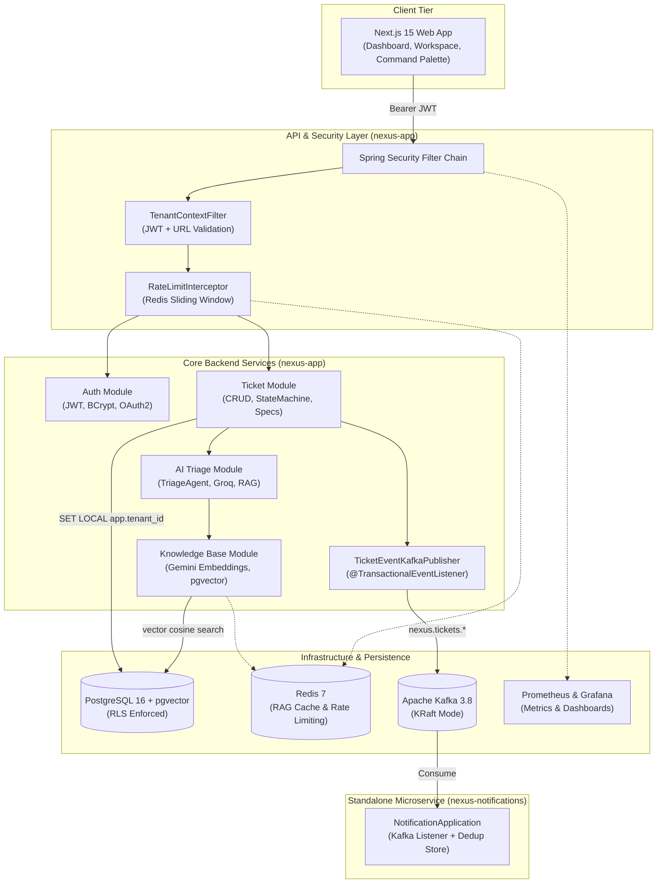
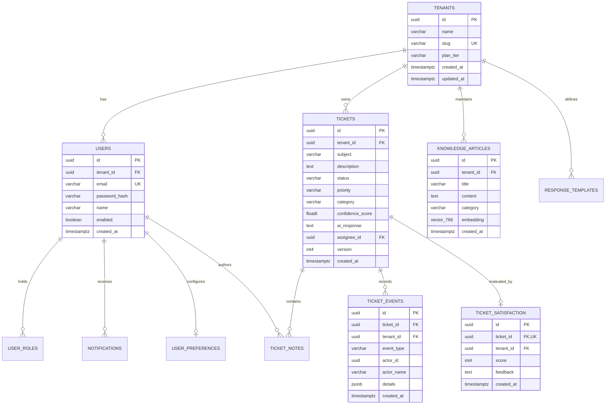

# Nexus — Complete Repository Architecture & Implementation Report

A comprehensive, in-depth technical analysis of the **Nexus** platform — a multi-tenant, AI-powered customer support SaaS built with **Java 21**, **Spring Boot 3.4**, **Spring AI**, **PostgreSQL 16 (pgvector)**, **Apache Kafka**, **Redis**, **Resilience4j**, and **Next.js 15**.

---

## 📑 Table of Contents

1. [Executive Summary](#-1-executive-summary)
2. [High-Level Architecture & Monorepo Structure](#-2-high-level-architecture--monorepo-structure)
3. [Database Architecture & Migrations (V1 – V12)](#-3-database-architecture--migrations-v1--v12)
4. [Multi-Tenancy & Zero-Leakage Data Isolation](#-4-multi-tenancy--zero-leakage-data-isolation)
5. [Security, Authentication & RBAC](#-5-security-authentication--rbac)
6. [AI Triage Engine & Semantic RAG Pipeline](#-6-ai-triage-engine--semantic-rag-pipeline)
7. [Event-Driven Architecture & Messaging Subsystem](#-7-event-driven-architecture--messaging-subsystem)
8. [Resilience, Caching & Distributed Rate Limiting](#-8-resilience-caching--distributed-rate-limiting)
9. [Observability, Telemetry & Audit Logging](#-9-observability-telemetry--audit-logging)
10. [Domain Model & Core Business Subsystems](#-10-domain-model--core-business-subsystems)
11. [Frontend Application Architecture (`nexus-frontend`)](#-11-frontend-application-architecture-nexus-frontend)
12. [Automated Testing & Architecture Verification](#-12-automated-testing--architecture-verification)
13. [DevOps, CI/CD, Containerization & Deployment](#-13-devops-cicd-containerization--deployment)
14. [Complete Source File Inventory](#-14-complete-source-file-inventory)

---

## 🌟 1. Executive Summary

**Nexus** is an enterprise-grade customer support platform designed to automate ticket classification, semantic knowledge-base retrieval, and AI-assisted drafting and resolution while enforcing strict tenant isolation and high availability.

### Key Capabilities:
- **Zero-Trust Multi-Tenancy**: Data isolation enforced natively in PostgreSQL via transaction-scoped Row-Level Security (`SET LOCAL app.tenant_id`) and fail-closed policies.
- **Autonomous AI Triage**: Spring AI orchestrates LLM inference (Groq / Llama 3.3 70B) and RAG (Google Gemini 768-dim embeddings + pgvector cosine similarity).
- **Metric-Based Confidence Scoring**: Confidence derived mathematically from measurable retrieval similarity, JSON schema validity, and category alignment rather than subjective LLM self-reporting.
- **Event-Driven Resilience**: Kafka decouples ticket ingestion from AI processing; Resilience4j protects downstream AI APIs; Redis powers distributed sliding-window rate limiting.
- **Modern Web Interface**: Next.js 15 App Router dashboard with a dark glassmorphic design system, interactive ticket workspace, command palette (`⌘K`), and live triage simulations.

---

## 🏛️ 2. High-Level Architecture & Monorepo Structure

Nexus follows a **Modular Monolith** architecture for its core services, supplemented by an event-driven standalone notification microservice and a modern React frontend.



### Module Breakdown

| Directory / Module | Type | Purpose | Primary Technologies |
|---|---|---|---|
| [`nexus-app`](file:///a:/Nexus/nexus-app) | Maven Module | Core API, domain logic, AI triage, multitenancy, persistence | Spring Boot 3.4.1, Spring AI, Hibernate/JPA, PostgreSQL, Resilience4j |
| [`nexus-notifications`](file:///a:/Nexus/nexus-notifications) | Maven Module | Event-driven microservice for alerts & notifications | Spring Boot 3.4.1, Spring Kafka, In-Memory Dedup Store |
| [`nexus-frontend`](file:///a:/Nexus/nexus-frontend) | Node.js App | Next.js 15 Web UI for support agents and administrators | Next.js 15, TypeScript, React 19, CSS Modules |
| [`docker/`](file:///a:/Nexus/docker) | Config / Compose | Local infrastructure orchestration and monitoring | Postgres (pgvector), Redis, Kafka KRaft, Prometheus, Grafana |
| [`.github/`](file:///a:/Nexus/.github) | CI/CD | 8-step continuous integration and automated deployment | GitHub Actions, Gitleaks, OWASP Dependency-Check, JaCoCo, Docker |

---

## 🗄️ 3. Database Architecture & Migrations (V1 – V12)

The database layer runs on **PostgreSQL 16** with **Flyway** executing structured database migrations.

```
nexus-app/src/main/resources/db/migration/
├── V1__baseline_schema.sql                      # Tenants, Tickets, Vector extension, Seed Tenants
├── V2__rls_policies.sql                         # Low-privilege nexus_app role, RLS on tickets
├── V3__users_and_roles.sql                      # Users, User Roles join table, RLS, Seed Users
├── V4__knowledge_base_pgvector.sql              # knowledge_articles with vector(768) and HNSW index
├── V5__ticket_events.sql                        # ticket_events immutable audit trail (JSONB)
├── V6__ticket_notes.sql                         # ticket_notes for internal agent collaboration
├── V7__notifications.sql                        # notifications table for in-app user alerts
├── V8__user_preferences.sql                     # user_preferences table (theme, email digest, widgets)
├── V9__response_templates.sql                   # response_templates with placeholder support
├── V10__ticket_satisfaction.sql                 # ticket_satisfaction (CSAT 1-5 stars rating)
├── V11__fix_knowledge_articles_rls_policy.sql   # Fixes RLS session variable alignment on KB articles
└── V12__fix_rls_missing_true_parameter.sql      # Standardizes fail-closed parameter across all policies
```

### Entity Relationship Diagram



### Key Schema Decisions:
1. **Vector Embeddings (HNSW)**: `knowledge_articles.embedding` uses `vector(768)` matching Gemini `text-embedding-004`. The index is built using `HNSW (vector_cosine_ops)` for fast approximate nearest-neighbor lookups.
2. **Optimistic Locking**: `tickets.version` prevents concurrent overwrite conflicts between human agents and automated AI workers.
3. **Fail-Closed RLS Policy Pattern**:
   ```sql
   CREATE POLICY tenant_isolation ON tickets
       USING (tenant_id = current_setting('app.tenant_id', true)::uuid)
       WITH CHECK (tenant_id = current_setting('app.tenant_id', true)::uuid);
   ```
   The `true` flag returns `NULL` instead of throwing an error when `app.tenant_id` is unset. Since `tenant_id = NULL` evaluates to false, zero rows are returned by default.

---

## 🔒 4. Multi-Tenancy & Zero-Leakage Data Isolation

Nexus guarantees that tenant data never leaks across tenant boundaries through a 3-tier isolation mechanism:

```mermaid
sequenceDiagram
    participant Client as HTTP Client
    participant TCF as TenantContextFilter
    participant TC as TenantContext (ThreadLocal)
    participant SpringSec as Spring Security (JWT)
    participant DS as TenantAwareDataSource
    participant PG as PostgreSQL (RLS Engine)

    Client->>TCF: HTTP Request (Bearer JWT, URL: /tenants/{tenantId}/tickets)
    TCF->>SpringSec: Validate JWT & Claims
    SpringSec-->>TCF: JWT Claims (sub, userId, tenantId, roles)
    
    rect rgb(30, 40, 60)
        Note over TCF: Tenant Validation & Cross-Tenant Check
        TCF->>TCF: Verify JWT tenantId == URL tenantId
        alt Mismatch Detected
            TCF-->>Client: 403 Forbidden (Tenant Mismatch)
        else Verified
            TCF->>TC: setTenantId(tenantId)
            TCF->>TCF: MDC.put("tenantId", tenantId)
        end
    end

    TCF->>DS: Execute Service / Repository Query
    DS->>DS: Intercept setAutoCommit(false)
    DS->>PG: SET LOCAL app.tenant_id = '{tenantId}'
    DS->>PG: SELECT * FROM tickets WHERE ...
    Note over PG: RLS Policy filters: tenant_id = current_setting('app.tenant_id')
    PG-->>DS: Only Tenant's Rows Returned
    DS-->>Client: HTTP 200 OK (Scoped Response)

    Note over TCF,TC: finally { TenantContext.clear(); MDC.remove("tenantId"); }
```

### Core Multitenancy Classes:
- [**`TenantContext.java`**](file:///a:/Nexus/nexus-app/src/main/java/com/nexus/common/multitenancy/TenantContext.java): ThreadLocal container storing the current tenant UUID.
- [**`TenantContextFilter.java`**](file:///a:/Nexus/nexus-app/src/main/java/com/nexus/common/multitenancy/TenantContextFilter.java): Extracts tenant from JWT, validates against the URL path, enforces UUID format constraints, and clears ThreadLocal/MDC in a `finally` block.
- [**`TenantAwareDataSource.java`**](file:///a:/Nexus/nexus-app/src/main/java/com/nexus/common/multitenancy/TenantAwareDataSource.java): Dynamic JDBC proxy wrapping HikariCP connections. It intercepts transaction start (`setAutoCommit(false)`) to execute `SET LOCAL app.tenant_id = '...'`. Because `SET LOCAL` is scoped to the transaction, PostgreSQL resets it on commit or rollback.

---

## 🛡️ 5. Security, Authentication & RBAC

### 1. Stateless Security Architecture
- [**`SecurityConfig.java`**](file:///a:/Nexus/nexus-app/src/main/java/com/nexus/common/security/SecurityConfig.java):
  - Configures Spring Security with OAuth2 Resource Server.
  - CSRF disabled for stateless REST endpoints.
  - Custom `BearerTokenAuthenticationEntryPoint` for API endpoints (`/api/**`) ensuring `401 Unauthorized` challenge headers.
  - Method-level security enabled (`@EnableMethodSecurity`).
- [**`JwtTokenProvider.java`**](file:///a:/Nexus/nexus-app/src/main/java/com/nexus/common/security/jwt/JwtTokenProvider.java): Issues HMAC-SHA256 tokens signed with a 256-bit secret. Claims include `sub`, `userId`, `tenantId`, and `roles`.
- [**`OAuth2LoginSuccessHandler.java`**](file:///a:/Nexus/nexus-app/src/main/java/com/nexus/common/security/oauth2/OAuth2LoginSuccessHandler.java): Handles "Sign in with Google", provisioning new accounts or linking existing users and issuing JWT tokens.

### 2. Dual DataSource Architecture (RLS Bypass for Login)
When an unauthenticated user logs in at `POST /api/v1/auth/login`, their tenant is unknown. Because the primary DataSource operates as low-privilege `nexus_app` with RLS fail-closed, all user queries would return 0 rows.
- [**`AuthDataSourceConfig.java`**](file:///a:/Nexus/nexus-app/src/main/java/com/nexus/common/security/AuthDataSourceConfig.java): Provisions a dedicated secondary connection pool operating as the database owner (`nexus`), used strictly by `NexusUserDetailsService` to resolve credentials before authentication.

### 3. Role-Based Access Control Matrix

| Role | Permissions |
|---|---|
| `ROLE_AGENT` | Read tickets, create tickets, update ticket fields, transition ticket status, add internal notes. |
| `ROLE_ADMIN` | All `ROLE_AGENT` permissions + delete tickets, manage knowledge articles, manage canned templates, invite users. |
| `ROLE_OWNER` | All `ROLE_ADMIN` permissions + tenant billing, plan tier modifications, security configurations. |

---

## 🤖 6. AI Triage Engine & Semantic RAG Pipeline

```mermaid
sequenceDiagram
    participant TS as TriageService
    participant Agent as TriageAgent
    participant RAG as KnowledgeBaseSearchService
    participant Gemini as GeminiEmbeddingService
    participant PG as PostgreSQL (pgvector)
    participant Groq as Groq API (Llama 3.3 70B)
    participant Calc as ConfidenceScoreCalculator

    TS->>Agent: triage(subject, description)
    Agent->>RAG: search(subject + " " + description)
    
    rect rgb(20, 30, 40)
        Note over RAG,Gemini: RAG Vector Search & Cache
        RAG->>Gemini: embed(queryText)
        Gemini-->>RAG: 768-dim float vector
        RAG->>PG: SELECT *, (1 - (embedding <=> :vector)) AS similarity FROM knowledge_articles ORDER BY embedding <=> :vector LIMIT 3
        PG-->>RAG: List<RetrievedArticle>
    end

    RAG-->>Agent: Relevant Articles & Similarity Scores
    Agent->>Agent: Build Structured Prompt (System + User + KB Context)
    
    rect rgb(30, 20, 40)
        Note over Agent,Groq: Resilience4j Circuit Breaker & Retry
        Agent->>Groq: Prompt Execution (ChatClient)
        Groq-->>Agent: JSON Response {category, priority, suggested_reply, reasoning}
    end

    Agent->>Calc: calculate(articles, parseSuccess, category)
    Note over Calc: Confidence = (0.5 * Sim) + (0.25 * Parse) + (0.25 * CategoryAgreement)
    Calc-->>Agent: Confidence Score (0.0 – 1.0)
    Agent-->>TS: TriageResult

    rect rgb(20, 40, 30)
        Note over TS: Autonomous State Machine Progression
        TS->>TS: NEW -> CLASSIFIED -> AI_DRAFTED
        alt Confidence >= Threshold && AutoResolve Enabled
            TS->>TS: AI_DRAFTED -> AUTO_RESOLVED
        else Low Confidence / Escalation Needed
            TS->>TS: AI_DRAFTED -> ESCALATED
        end
    end
```



### Key AI Components:
1. [**`GeminiEmbeddingService.java`**](file:///a:/Nexus/nexus-app/src/main/java/com/nexus/ai/embedding/GeminiEmbeddingService.java): REST client interfacing with Google's `text-embedding-004` model to generate 768-dimensional float vectors.
2. [**`KnowledgeBaseSearchService.java`**](file:///a:/Nexus/nexus-app/src/main/java/com/nexus/ai/rag/KnowledgeBaseSearchService.java): Coordinates semantic retrieval using native pgvector cosine distance queries (`<=>`). Results are cached in Redis (`ragSearch` cache, 1-hour TTL) keyed by tenant and query.
3. [**`TriageAgent.java`**](file:///a:/Nexus/nexus-app/src/main/java/com/nexus/ai/triage/TriageAgent.java): Invokes Groq Llama 3.3 70B via Spring AI `ChatClient` with a strict JSON contract. Protected by `@CircuitBreaker` and `@Retry`.
4. [**`ConfidenceScoreCalculator.java`**](file:///a:/Nexus/nexus-app/src/main/java/com/nexus/ai/triage/ConfidenceScoreCalculator.java):
   $$\text{Confidence Score} = (0.50 \times \text{Avg KB Similarity}) + (0.25 \times \text{JSON Parse Valid}) + (0.25 \times \text{Category Agreement})$$
5. [**`TriageService.java`**](file:///a:/Nexus/nexus-app/src/main/java/com/nexus/ai/triage/TriageService.java): Drives entity persistence, audit logging, metrics emission, and state transitions.

---

## ⚡ 7. Event-Driven Architecture & Messaging Subsystem

### 1. Transactional Outbound Events
- [**`TicketEventKafkaPublisher.java`**](file:///a:/Nexus/nexus-app/src/main/java/com/nexus/ticket/infrastructure/messaging/TicketEventKafkaPublisher.java): Listens to Spring domain events (`TicketCreatedEvent`, `TicketStatusChangedEvent`) using `@TransactionalEventListener(phase = AFTER_COMMIT)`. Kafka messages are published **only after the database transaction commits**, eliminating phantom events upon rollbacks.
- **Partitioning Affinity**: Kafka message keys are set to `ticketId.toString()`, guaranteeing that all status changes for a specific ticket arrive in chronological order on the same partition.

### 2. Kafka Topics & Consumers
- **`nexus.tickets.created`**:
  - Consumed by [**`TriageEventConsumer.java`**](file:///a:/Nexus/nexus-app/src/main/java/com/nexus/ticket/infrastructure/messaging/TriageEventConsumer.java) in `nexus-app` (`nexus-triage-group`). Automatically triages newly created tickets in background threads without blocking API response times.
- **`nexus.tickets.status-changed`**:
  - Consumed by [**`NotificationEventConsumer.java`**](file:///a:/Nexus/nexus-notifications/src/main/java/com/nexus/notifications/consumer/NotificationEventConsumer.java) in the standalone `nexus-notifications` microservice.
  - Implements an [**`InMemoryDedupStore.java`**](file:///a:/Nexus/nexus-notifications/src/main/java/com/nexus/notifications/dedup/InMemoryDedupStore.java) to achieve idempotent notification delivery.

---

## 🛡️ 8. Resilience, Caching & Distributed Rate Limiting

### 1. Resilience4j Circuit Breaker & Retry
Configured in `application.yml` and applied on `TriageAgent.callLlm()`:
- **Circuit Breaker (`groq-llm`)**: Sliding window of 10 calls. Opens when failure rate exceeds 50%, transitioning to `OPEN` for 30s before trying `HALF_OPEN`.
- **Retry (`groq-llm`)**: Up to 3 attempts with exponential backoff ($1000\text{ms} \rightarrow 2000\text{ms} \rightarrow 4000\text{ms}$).
- **Fallback**: Returns a safe low-confidence ($0.0$) escalation fallback, preventing user-facing HTTP 500 errors during LLM outages.

### 2. Redis Caching
- [**`CacheConfig.java`**](file:///a:/Nexus/nexus-app/src/main/java/com/nexus/common/config/CacheConfig.java): Configures Spring Cache backed by Redis with JSON serialization.
- Caches semantic RAG search queries under the `ragSearch` cache with a 1-hour TTL, saving embedding generation costs and database roundtrips.

### 3. Distributed Sliding-Window Rate Limiter
- [**`SlidingWindowRateLimiter.java`**](file:///a:/Nexus/nexus-app/src/main/java/com/nexus/common/ratelimit/SlidingWindowRateLimiter.java): Implements an atomic Lua script executed in Redis:
  ```lua
  local key = KEYS[1]
  local limit = tonumber(ARGV[1])
  local window = tonumber(ARGV[2])
  local current = tonumber(redis.call('GET', key) or '0')
  if current >= limit then
      local ttl = redis.call('PTTL', key)
      return {current, ttl}
  end
  current = redis.call('INCR', key)
  if current == 1 then
      redis.call('EXPIRE', key, window)
  end
  local ttl = redis.call('PTTL', key)
  return {current, ttl}
  ```
- Injects standard rate-limiting headers: `X-RateLimit-Limit`, `X-RateLimit-Remaining`, `X-RateLimit-Reset-Ms`.

---

## 📊 9. Observability, Telemetry & Audit Logging

- **Distributed Tracing & MDC**: [**`TraceIdFilter.java`**](file:///a:/Nexus/nexus-app/src/main/java/com/nexus/common/observability/TraceIdFilter.java) generates a UUID `traceId` per request and populates `traceId` and `tenantId` in Slf4j MDC for structured JSON logs.
- **AI Audit Trail**: [**`TriageAuditLogger.java`**](file:///a:/Nexus/nexus-app/src/main/java/com/nexus/ai/triage/TriageAuditLogger.java) outputs structured audit events capturing model parameters, token latencies, confidence metrics, and reasoning.
- **Micrometer Metrics & Prometheus**:
  - `ticket.triage.duration`: Timer recording end-to-end AI latency tagged by category.
  - `ticket.triage.count`: Counter tracking triaged tickets and auto-resolve rates.
  - `ticket.triage.confidence`: Distribution summary recording confidence score distributions.
  - `rate_limit.denied.count`: Counter for rate-limited requests per tenant.
- **Grafana Dashboard**: Pre-configured JSON dashboard in [`docker/grafana/dashboards/nexus-triage.json`](file:///a:/Nexus/docker/grafana/dashboards/nexus-triage.json).

---

## 🎯 10. Domain Model & Core Business Subsystems

### 1. State Machine Grammar (`TicketStateMachine.java`)
```
NEW ───► CLASSIFIED ───► AI_DRAFTED ───┬───► AUTO_RESOLVED ───► CLOSED
                                       └───► ESCALATED ───► IN_PROGRESS ───► RESOLVED ───► CLOSED
```

### 2. Feature Services & Controllers

| Subsystem | Controller | Service | Persistence | Primary Capabilities |
|---|---|---|---|---|
| **Tickets Core** | `TicketController` | `TicketService` | `TicketRepository`, `TicketSpecifications` | CRUD, dynamic JPA criteria search, pagination, status transitions. |
| **Activity Timeline** | `TicketEventController` | `TicketEventService` | `TicketEventRepository` | Immutable event audit trail logging every mutation with JSONB details. |
| **Internal Notes** | `TicketNoteController` | `TicketNoteService` | `TicketNoteRepository` | Private internal discussion notes for agent-to-agent collaboration. |
| **Canned Templates** | `ResponseTemplateController` | `ResponseTemplateService` | `ResponseTemplateRepository` | Canned response repository with dynamic variable placeholders (`{{customer_name}}`). |
| **CSAT Satisfaction** | `TicketSatisfactionController` | `TicketSatisfactionService` | `TicketSatisfactionRepository` | Customer satisfaction rating (1–5 scale with feedback) enforced once per ticket. |
| **Notifications** | `NotificationController` | `NotificationService` | `NotificationRepository` | In-app user notifications for escalations, SLA warnings, assignments. |
| **Analytics & KPIs** | `AnalyticsController` | `AnalyticsService` | Custom aggregation queries | Calculates MTTR, ticket volume by status/priority, CSAT averages, SLA metrics. |
| **Scheduled Jobs** | — | `ScheduledJobs` | — | Background sweeps for SLA breaches and unindexed knowledge article backfilling. |

---

## 💻 11. Frontend Application Architecture (`nexus-frontend`)

A Next.js 15 App Router application in [`nexus-frontend/`](file:///a:/Nexus/nexus-frontend) styled with a custom dark glassmorphic design system:

```
nexus-frontend/src/
├── app/
│   ├── (dashboard)/
│   │   ├── dashboard/page.tsx       # Live KPI analytics, ticket distribution, recent activity
│   │   ├── tickets/page.tsx         # Ticket list with search, status/priority/category filters, pagination
│   │   ├── tickets/new/page.tsx     # Ticket submission wizard
│   │   ├── tickets/[id]/page.tsx    # Interactive ticket detail & triage workspace
│   │   ├── knowledge/page.tsx       # KB management & semantic vector search tester
│   │   ├── notifications/page.tsx   # User notification inbox with read/unread toggles
│   │   ├── settings/page.tsx        # Response template management & user preferences
│   │   ├── team/page.tsx            # Tenant user roster and RBAC roles
│   │   └── layout.tsx               # Global dashboard shell (Sidebar, Header, CommandPalette)
│   ├── globals.css                  # Custom design tokens, glassmorphism utilities & animations
│   └── page.tsx                     # Landing / Authentication portal
├── components/
│   ├── ui/                          # Button, Card, Badge, Skeleton, Pagination, EmptyState
│   ├── layout/                      # Sidebar, Header, CommandPalette (⌘K)
│   └── features/tickets/            # TicketHeader, TicketDescription, TicketEditForm,
│                                    # TicketFilters, TicketTable, Timeline, TransitionPanel,
│                                    # TriagePanel, NotesSection
├── context/
│   └── AuthContext.tsx              # JWT handling, tenant state, mock role-switcher
└── lib/
    ├── api.ts                       # Typed API client covering all backend endpoints
    └── auth.ts                      # Token storage & JWT decoding utilities
```

### UI Highlights:
- **Interactive Ticket Workspace**: Real-time AI triage triggers with multi-stage scanning animations, inline ticket editing with optimistic UI updates, state-machine transition buttons, an internal notes feed, and an activity audit log.
- **Global Command Palette (`⌘K` / `Ctrl+K`)**: Rapid keyboard navigation across tickets, knowledge base articles, settings, and role switching.
- **Zero-Dependency Component Primitives**: Built without heavy UI libraries to preserve full control over animations, glassmorphism effects, and CSS tokens.

---

## 🧪 12. Automated Testing & Architecture Verification

1. **Domain Purity Enforcement ([`DomainPurityTest.java`](file:///a:/Nexus/nexus-app/src/test/java/com/nexus/architecture/DomainPurityTest.java))**:
   - Uses **ArchUnit** to verify that domain packages never import Spring, JPA, or external framework dependencies.
2. **State Machine Verification ([`TicketStateMachineTest.java`](file:///a:/Nexus/nexus-app/src/test/java/com/nexus/ticket/domain/TicketStateMachineTest.java))**:
   - 20 unit tests executing in $<300\text{ms}$ validating all legal and illegal status transitions.
3. **Database RLS Multi-Tenant Isolation ([`CrossTenantIsolationIT.java`](file:///a:/Nexus/nexus-app/src/test/java/com/nexus/tenant/CrossTenantIsolationIT.java))**:
   - Testcontainers-backed integration test running against real PostgreSQL + pgvector instances. Verifies cross-tenant invisible reads, cross-tenant update prevention, cross-tenant delete prevention, and fail-closed zero rows when `app.tenant_id` is missing.
4. **AI & Triage Test Suite**:
   - `TriageAgentTest.java`, `TriageServiceTest.java`, `ConfidenceScoreCalculatorTest.java`, `GeminiEmbeddingServiceTest.java`, `KnowledgeBaseSearchServiceTest.java`.
5. **Security & Authentication Tests**:
   - `JwtTokenProviderTest.java`, `TicketSecurityTest.java` (verifying RBAC `@PreAuthorize` rules and 401/403 challenges).

---

## 🚀 13. DevOps, CI/CD, Containerization & Deployment

1. [**`Dockerfile`**](file:///a:/Nexus/Dockerfile): Multi-stage container build (Eclipse Temurin 21 JDK builder $\rightarrow$ Temurin 21 JRE runtime, non-root user `nexus`, container memory tuning `MaxRAMPercentage=75.0`).
2. [**`.github/workflows/ci.yml`**](file:///a:/Nexus/.github/workflows/ci.yml): 8-step GitHub Actions pipeline:
   - `1. Lint & Format Check` $\rightarrow$ `2. Gitleaks Secret Scan` $\rightarrow$ `3. STUB Marker Check` $\rightarrow$ `4. OWASP Dependency Check` $\rightarrow$ `5-6. Testcontainers Unit & Integration Tests + JaCoCo` $\rightarrow$ `7. Docker Build` $\rightarrow$ `8. Render Auto-Deploy Hook`.
3. [**`render.yaml`**](file:///a:/Nexus/render.yaml): Infrastructure as Code blueprint for Render cloud hosting.
4. **PowerShell Dev Helpers**:
   - [`start-backend.ps1`](file:///a:/Nexus/start-backend.ps1): Boots the Spring Boot backend with cloud database configuration.
   - [`start-frontend.ps1`](file:///a:/Nexus/start-frontend.ps1): Runs the Next.js development server.
   - [`seed-embeddings.ps1`](file:///a:/Nexus/seed-embeddings.ps1) & [`trigger-backfill.ps1`](file:///a:/Nexus/trigger-backfill.ps1): Automates Gemini vector embedding generation for initial knowledge base articles.

---

## 📂 14. Complete Source File Inventory

### Root & Infrastructure Files
- [`pom.xml`](file:///a:/Nexus/pom.xml) — Root Maven parent/aggregator POM
- [`docker-compose.yml`](file:///a:/Nexus/docker-compose.yml) — Local development stack (Postgres+pgvector, Redis, Kafka KRaft, Prometheus, Grafana)
- [`Dockerfile`](file:///a:/Nexus/Dockerfile) — Multi-stage production container build
- [`render.yaml`](file:///a:/Nexus/render.yaml) — Render Cloud Infrastructure-as-Code blueprint
- [`.github/workflows/ci.yml`](file:///a:/Nexus/.github/workflows/ci.yml) — 8-step CI/CD GitHub Actions workflow
- [`docker/init-db.sql`](file:///a:/Nexus/docker/init-db.sql) — PostgreSQL initialization script
- [`docker/prometheus.yml`](file:///a:/Nexus/docker/prometheus.yml) — Prometheus metric scraping configuration
- [`docker/grafana/dashboards/nexus-triage.json`](file:///a:/Nexus/docker/grafana/dashboards/nexus-triage.json) — Provisioned Grafana triage dashboard
- [`start-backend.ps1`](file:///a:/Nexus/start-backend.ps1) — PowerShell backend bootstrap script
- [`start-frontend.ps1`](file:///a:/Nexus/start-frontend.ps1) — PowerShell frontend bootstrap script
- [`seed-embeddings.ps1`](file:///a:/Nexus/seed-embeddings.ps1) — Vector embeddings seed utility

### Backend Java Source Code (`nexus-app`)
- **Root & Application**:
  - [`NexusApplication.java`](file:///a:/Nexus/nexus-app/src/main/java/com/nexus/NexusApplication.java)
- **AI & RAG Subsystem (`com.nexus.ai.*`)**:
  - [`AiProperties.java`](file:///a:/Nexus/nexus-app/src/main/java/com/nexus/ai/config/AiProperties.java)
  - [`EmbeddingException.java`](file:///a:/Nexus/nexus-app/src/main/java/com/nexus/ai/embedding/EmbeddingException.java)
  - [`EmbeddingService.java`](file:///a:/Nexus/nexus-app/src/main/java/com/nexus/ai/embedding/EmbeddingService.java)
  - [`GeminiEmbeddingService.java`](file:///a:/Nexus/nexus-app/src/main/java/com/nexus/ai/embedding/GeminiEmbeddingService.java)
  - [`KnowledgeArticleEntity.java`](file:///a:/Nexus/nexus-app/src/main/java/com/nexus/ai/knowledge/KnowledgeArticleEntity.java)
  - [`KnowledgeArticleRepository.java`](file:///a:/Nexus/nexus-app/src/main/java/com/nexus/ai/knowledge/KnowledgeArticleRepository.java)
  - [`KnowledgeBaseSearchService.java`](file:///a:/Nexus/nexus-app/src/main/java/com/nexus/ai/rag/KnowledgeBaseSearchService.java)
  - [`RetrievedArticle.java`](file:///a:/Nexus/nexus-app/src/main/java/com/nexus/ai/rag/RetrievedArticle.java)
  - [`TriageAgent.java`](file:///a:/Nexus/nexus-app/src/main/java/com/nexus/ai/triage/TriageAgent.java)
  - [`TriageAuditLogger.java`](file:///a:/Nexus/nexus-app/src/main/java/com/nexus/ai/triage/TriageAuditLogger.java)
  - [`ConfidenceScoreCalculator.java`](file:///a:/Nexus/nexus-app/src/main/java/com/nexus/ai/triage/ConfidenceScoreCalculator.java)
  - [`TriageResult.java`](file:///a:/Nexus/nexus-app/src/main/java/com/nexus/ai/triage/TriageResult.java)
  - [`TriageService.java`](file:///a:/Nexus/nexus-app/src/main/java/com/nexus/ai/triage/TriageService.java)
  - [`TriageController.java`](file:///a:/Nexus/nexus-app/src/main/java/com/nexus/ai/api/TriageController.java)
- **Analytics Subsystem (`com.nexus.analytics.*`)**:
  - [`AnalyticsController.java`](file:///a:/Nexus/nexus-app/src/main/java/com/nexus/analytics/api/AnalyticsController.java)
  - [`AnalyticsService.java`](file:///a:/Nexus/nexus-app/src/main/java/com/nexus/analytics/application/AnalyticsService.java)
- **Common & Infrastructure (`com.nexus.common.*`)**:
  - [`AsyncConfig.java`](file:///a:/Nexus/nexus-app/src/main/java/com/nexus/common/config/AsyncConfig.java), [`CacheConfig.java`](file:///a:/Nexus/nexus-app/src/main/java/com/nexus/common/config/CacheConfig.java), [`CorsConfig.java`](file:///a:/Nexus/nexus-app/src/main/java/com/nexus/common/config/CorsConfig.java), [`KafkaConfig.java`](file:///a:/Nexus/nexus-app/src/main/java/com/nexus/common/config/KafkaConfig.java), [`WebMvcConfig.java`](file:///a:/Nexus/nexus-app/src/main/java/com/nexus/common/config/WebMvcConfig.java)
  - [`ErrorResponse.java`](file:///a:/Nexus/nexus-app/src/main/java/com/nexus/common/exception/ErrorResponse.java), [`GlobalExceptionHandler.java`](file:///a:/Nexus/nexus-app/src/main/java/com/nexus/common/exception/GlobalExceptionHandler.java), [`IllegalTicketTransitionException.java`](file:///a:/Nexus/nexus-app/src/main/java/com/nexus/common/exception/IllegalTicketTransitionException.java), [`TenantNotFoundException.java`](file:///a:/Nexus/nexus-app/src/main/java/com/nexus/common/exception/TenantNotFoundException.java), [`TicketNotFoundException.java`](file:///a:/Nexus/nexus-app/src/main/java/com/nexus/common/exception/TicketNotFoundException.java)
  - [`TenantContext.java`](file:///a:/Nexus/nexus-app/src/main/java/com/nexus/common/multitenancy/TenantContext.java), [`TenantContextFilter.java`](file:///a:/Nexus/nexus-app/src/main/java/com/nexus/common/multitenancy/TenantContextFilter.java), [`TenantAwareDataSource.java`](file:///a:/Nexus/nexus-app/src/main/java/com/nexus/common/multitenancy/TenantAwareDataSource.java), [`TenantDataSourceConfig.java`](file:///a:/Nexus/nexus-app/src/main/java/com/nexus/common/multitenancy/TenantDataSourceConfig.java)
  - [`TraceIdFilter.java`](file:///a:/Nexus/nexus-app/src/main/java/com/nexus/common/observability/TraceIdFilter.java)
  - [`RateLimitInterceptor.java`](file:///a:/Nexus/nexus-app/src/main/java/com/nexus/common/ratelimit/RateLimitInterceptor.java), [`RateLimitResult.java`](file:///a:/Nexus/nexus-app/src/main/java/com/nexus/common/ratelimit/RateLimitResult.java), [`RateLimitStrategy.java`](file:///a:/Nexus/nexus-app/src/main/java/com/nexus/common/ratelimit/RateLimitStrategy.java), [`SlidingWindowRateLimiter.java`](file:///a:/Nexus/nexus-app/src/main/java/com/nexus/common/ratelimit/SlidingWindowRateLimiter.java)
  - [`ScheduledJobs.java`](file:///a:/Nexus/nexus-app/src/main/java/com/nexus/common/scheduling/ScheduledJobs.java)
  - [`SecurityConfig.java`](file:///a:/Nexus/nexus-app/src/main/java/com/nexus/common/security/SecurityConfig.java), [`AuthDataSourceConfig.java`](file:///a:/Nexus/nexus-app/src/main/java/com/nexus/common/security/AuthDataSourceConfig.java), [`AuthController.java`](file:///a:/Nexus/nexus-app/src/main/java/com/nexus/common/security/AuthController.java), [`NexusUserDetails.java`](file:///a:/Nexus/nexus-app/src/main/java/com/nexus/common/security/NexusUserDetails.java), [`NexusUserDetailsService.java`](file:///a:/Nexus/nexus-app/src/main/java/com/nexus/common/security/NexusUserDetailsService.java), [`JwtTokenProvider.java`](file:///a:/Nexus/nexus-app/src/main/java/com/nexus/common/security/jwt/JwtTokenProvider.java), [`JwtProperties.java`](file:///a:/Nexus/nexus-app/src/main/java/com/nexus/common/security/jwt/JwtProperties.java), [`JwtConfig.java`](file:///a:/Nexus/nexus-app/src/main/java/com/nexus/common/security/jwt/JwtConfig.java), [`OAuth2LoginSuccessHandler.java`](file:///a:/Nexus/nexus-app/src/main/java/com/nexus/common/security/oauth2/OAuth2LoginSuccessHandler.java), [`UserEntity.java`](file:///a:/Nexus/nexus-app/src/main/java/com/nexus/common/security/user/UserEntity.java), [`UserRepository.java`](file:///a:/Nexus/nexus-app/src/main/java/com/nexus/common/security/user/UserRepository.java), [`UserRole.java`](file:///a:/Nexus/nexus-app/src/main/java/com/nexus/common/security/user/UserRole.java)
- **Notification Subsystem (`com.nexus.notification.*`)**:
  - [`NotificationController.java`](file:///a:/Nexus/nexus-app/src/main/java/com/nexus/notification/api/NotificationController.java), [`NotificationService.java`](file:///a:/Nexus/nexus-app/src/main/java/com/nexus/notification/application/NotificationService.java), [`NotificationResponse.java`](file:///a:/Nexus/nexus-app/src/main/java/com/nexus/notification/application/dto/NotificationResponse.java), [`NotificationEntity.java`](file:///a:/Nexus/nexus-app/src/main/java/com/nexus/notification/infrastructure/persistence/NotificationEntity.java), [`NotificationRepository.java`](file:///a:/Nexus/nexus-app/src/main/java/com/nexus/notification/infrastructure/persistence/NotificationRepository.java)
- **Tenant Subsystem (`com.nexus.tenant.*`)**:
  - [`PlanTier.java`](file:///a:/Nexus/nexus-app/src/main/java/com/nexus/tenant/domain/PlanTier.java), [`TenantEntity.java`](file:///a:/Nexus/nexus-app/src/main/java/com/nexus/tenant/infrastructure/persistence/TenantEntity.java), [`TenantRepository.java`](file:///a:/Nexus/nexus-app/src/main/java/com/nexus/tenant/infrastructure/persistence/TenantRepository.java)
- **Ticket Domain & Subsystems (`com.nexus.ticket.*`)**:
  - [`TicketStatus.java`](file:///a:/Nexus/nexus-app/src/main/java/com/nexus/ticket/domain/TicketStatus.java), [`TicketPriority.java`](file:///a:/Nexus/nexus-app/src/main/java/com/nexus/ticket/domain/TicketPriority.java), [`TicketCategory.java`](file:///a:/Nexus/nexus-app/src/main/java/com/nexus/ticket/domain/TicketCategory.java), [`TicketStateMachine.java`](file:///a:/Nexus/nexus-app/src/main/java/com/nexus/ticket/domain/TicketStateMachine.java)
  - [`TicketCreatedEvent.java`](file:///a:/Nexus/nexus-app/src/main/java/com/nexus/ticket/domain/event/TicketCreatedEvent.java), [`TicketStatusChangedEvent.java`](file:///a:/Nexus/nexus-app/src/main/java/com/nexus/ticket/domain/event/TicketStatusChangedEvent.java)
  - [`TicketController.java`](file:///a:/Nexus/nexus-app/src/main/java/com/nexus/ticket/api/TicketController.java), [`TicketEventController.java`](file:///a:/Nexus/nexus-app/src/main/java/com/nexus/ticket/api/TicketEventController.java), [`TicketNoteController.java`](file:///a:/Nexus/nexus-app/src/main/java/com/nexus/ticket/api/TicketNoteController.java), [`ResponseTemplateController.java`](file:///a:/Nexus/nexus-app/src/main/java/com/nexus/ticket/api/ResponseTemplateController.java), [`TicketSatisfactionController.java`](file:///a:/Nexus/nexus-app/src/main/java/com/nexus/ticket/api/TicketSatisfactionController.java)
  - [`TicketService.java`](file:///a:/Nexus/nexus-app/src/main/java/com/nexus/ticket/application/TicketService.java), [`TicketEventService.java`](file:///a:/Nexus/nexus-app/src/main/java/com/nexus/ticket/application/TicketEventService.java), [`TicketNoteService.java`](file:///a:/Nexus/nexus-app/src/main/java/com/nexus/ticket/application/TicketNoteService.java), [`ResponseTemplateService.java`](file:///a:/Nexus/nexus-app/src/main/java/com/nexus/ticket/application/ResponseTemplateService.java), [`TicketSatisfactionService.java`](file:///a:/Nexus/nexus-app/src/main/java/com/nexus/ticket/application/TicketSatisfactionService.java)
  - [`TicketEntity.java`](file:///a:/Nexus/nexus-app/src/main/java/com/nexus/ticket/infrastructure/persistence/TicketEntity.java), [`TicketRepository.java`](file:///a:/Nexus/nexus-app/src/main/java/com/nexus/ticket/infrastructure/persistence/TicketRepository.java), [`TicketSpecifications.java`](file:///a:/Nexus/nexus-app/src/main/java/com/nexus/ticket/infrastructure/persistence/TicketSpecifications.java)
  - [`TicketEventEntity.java`](file:///a:/Nexus/nexus-app/src/main/java/com/nexus/ticket/infrastructure/persistence/TicketEventEntity.java), [`TicketEventRepository.java`](file:///a:/Nexus/nexus-app/src/main/java/com/nexus/ticket/infrastructure/persistence/TicketEventRepository.java)
  - [`TicketNoteEntity.java`](file:///a:/Nexus/nexus-app/src/main/java/com/nexus/ticket/infrastructure/persistence/TicketNoteEntity.java), [`TicketNoteRepository.java`](file:///a:/Nexus/nexus-app/src/main/java/com/nexus/ticket/infrastructure/persistence/TicketNoteRepository.java)
  - [`ResponseTemplateEntity.java`](file:///a:/Nexus/nexus-app/src/main/java/com/nexus/ticket/infrastructure/persistence/ResponseTemplateEntity.java), [`ResponseTemplateRepository.java`](file:///a:/Nexus/nexus-app/src/main/java/com/nexus/ticket/infrastructure/persistence/ResponseTemplateRepository.java)
  - [`TicketSatisfactionEntity.java`](file:///a:/Nexus/nexus-app/src/main/java/com/nexus/ticket/infrastructure/persistence/TicketSatisfactionEntity.java), [`TicketSatisfactionRepository.java`](file:///a:/Nexus/nexus-app/src/main/java/com/nexus/ticket/infrastructure/persistence/TicketSatisfactionRepository.java)
  - [`TicketEventKafkaPublisher.java`](file:///a:/Nexus/nexus-app/src/main/java/com/nexus/ticket/infrastructure/messaging/TicketEventKafkaPublisher.java), [`TicketKafkaTopics.java`](file:///a:/Nexus/nexus-app/src/main/java/com/nexus/ticket/infrastructure/messaging/TicketKafkaTopics.java), [`TriageEventConsumer.java`](file:///a:/Nexus/nexus-app/src/main/java/com/nexus/ticket/infrastructure/messaging/TriageEventConsumer.java)

### Standalone Notification Microservice (`nexus-notifications`)
- [`NotificationApplication.java`](file:///a:/Nexus/nexus-notifications/src/main/java/com/nexus/notifications/NotificationApplication.java)
- [`NotificationEventConsumer.java`](file:///a:/Nexus/nexus-notifications/src/main/java/com/nexus/notifications/consumer/NotificationEventConsumer.java)
- [`TicketStatusChangedMessage.java`](file:///a:/Nexus/nexus-notifications/src/main/java/com/nexus/notifications/consumer/TicketStatusChangedMessage.java)
- [`InMemoryDedupStore.java`](file:///a:/Nexus/nexus-notifications/src/main/java/com/nexus/notifications/dedup/InMemoryDedupStore.java)
- [`NotificationDispatcher.java`](file:///a:/Nexus/notifications/src/main/java/com/nexus/notifications/handler/NotificationDispatcher.java)

### Frontend Next.js Source Code (`nexus-frontend`)
- **Pages**: [`page.tsx`](file:///a:/Nexus/nexus-frontend/src/app/page.tsx), [`dashboard/page.tsx`](file:///a:/Nexus/nexus-frontend/src/app/(dashboard)/dashboard/page.tsx), [`tickets/page.tsx`](file:///a:/Nexus/nexus-frontend/src/app/(dashboard)/tickets/page.tsx), [`tickets/[id]/page.tsx`](file:///a:/Nexus/nexus-frontend/src/app/(dashboard)/tickets/[id]/page.tsx), [`tickets/new/page.tsx`](file:///a:/Nexus/nexus-frontend/src/app/(dashboard)/tickets/new/page.tsx), [`knowledge/page.tsx`](file:///a:/Nexus/nexus-frontend/src/app/(dashboard)/knowledge/page.tsx), [`notifications/page.tsx`](file:///a:/Nexus/nexus-frontend/src/app/(dashboard)/notifications/page.tsx), [`settings/page.tsx`](file:///a:/Nexus/nexus-frontend/src/app/(dashboard)/settings/page.tsx), [`team/page.tsx`](file:///a:/Nexus/nexus-frontend/src/app/(dashboard)/team/page.tsx)
- **Features & UI Components**:
  - [`TicketHeader.tsx`](file:///a:/Nexus/nexus-frontend/src/components/features/tickets/TicketHeader.tsx), [`TicketDescription.tsx`](file:///a:/Nexus/nexus-frontend/src/components/features/tickets/TicketDescription.tsx), [`TicketEditForm.tsx`](file:///a:/Nexus/nexus-frontend/src/components/features/tickets/TicketEditForm.tsx), [`TicketFilters.tsx`](file:///a:/Nexus/nexus-frontend/src/components/features/tickets/TicketFilters.tsx), [`TicketTable.tsx`](file:///a:/Nexus/nexus-frontend/src/components/features/tickets/TicketTable.tsx), [`Timeline.tsx`](file:///a:/Nexus/nexus-frontend/src/components/features/tickets/Timeline.tsx), [`TransitionPanel.tsx`](file:///a:/Nexus/nexus-frontend/src/components/features/tickets/TransitionPanel.tsx), [`TriagePanel.tsx`](file:///a:/Nexus/nexus-frontend/src/components/features/tickets/TriagePanel.tsx), [`NotesSection.tsx`](file:///a:/Nexus/nexus-frontend/src/components/features/tickets/NotesSection.tsx)
  - [`Sidebar.tsx`](file:///a:/Nexus/nexus-frontend/src/components/layout/Sidebar.tsx), [`Header.tsx`](file:///a:/Nexus/nexus-frontend/src/components/layout/Header.tsx), [`CommandPalette.tsx`](file:///a:/Nexus/nexus-frontend/src/components/layout/CommandPalette.tsx)
  - [`Badge.tsx`](file:///a:/Nexus/nexus-frontend/src/components/ui/Badge.tsx), [`Button.tsx`](file:///a:/Nexus/nexus-frontend/src/components/ui/Button.tsx), [`Card.tsx`](file:///a:/Nexus/nexus-frontend/src/components/ui/Card.tsx), [`EmptyState.tsx`](file:///a:/Nexus/nexus-frontend/src/components/ui/EmptyState.tsx), [`Pagination.tsx`](file:///a:/Nexus/nexus-frontend/src/components/ui/Pagination.tsx), [`Skeleton.tsx`](file:///a:/Nexus/nexus-frontend/src/components/ui/Skeleton.tsx)
- **Context & Lib**: [`AuthContext.tsx`](file:///a:/Nexus/nexus-frontend/src/context/AuthContext.tsx), [`api.ts`](file:///a:/Nexus/nexus-frontend/src/lib/api.ts), [`auth.ts`](file:///a:/Nexus/nexus-frontend/src/lib/auth.ts), [`constants.ts`](file:///a:/Nexus/nexus-frontend/src/lib/constants.ts), [`utils.ts`](file:///a:/Nexus/nexus-frontend/src/lib/utils.ts)
