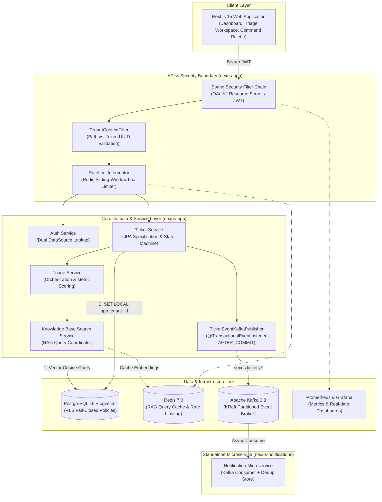
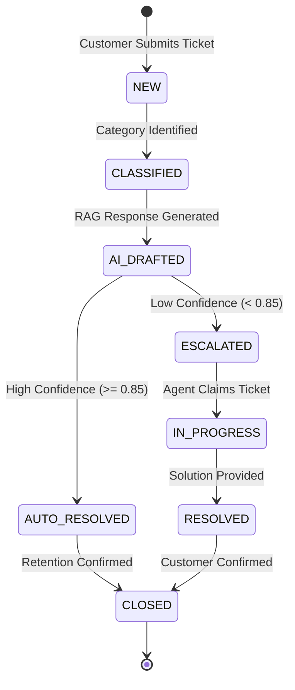
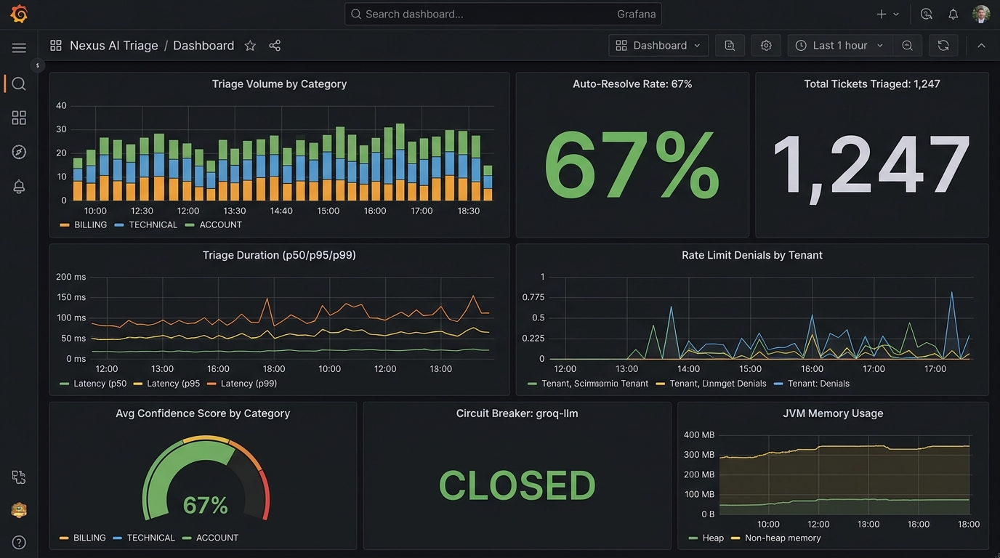

# Nexus — AI-Powered Multi-Tenant Customer Support SaaS

<div align="center">

[](https://github.com/mavericaks/Nexus/actions/workflows/ci.yml)
[](https://openjdk.org/projects/jdk/21/)
[](https://spring.io/projects/spring-boot)
[](https://nextjs.org/)
[](https://github.com/pgvector/pgvector)
[](https://kafka.apache.org/)
[](https://redis.io/)
[](https://www.docker.com/)
[](https://opensource.org/licenses/MIT)
[](https://nexus-tep5.onrender.com/swagger-ui.html)

<p align="center">
  <strong>An enterprise-grade, multi-tenant customer support platform engineering zero-trust database isolation, sub-second semantic RAG over vector embeddings, autonomous LLM triage with mathematical confidence scoring, and high-throughput event-driven messaging.</strong>
</p>

[Key Features](#-key-features) • [Architecture](#-system-architecture) • [AI Triage & RAG](#-ai-triage--semantic-rag-engine) • [Multi-Tenancy](#-multi-tenancy--zero-leakage-security) • [State Machine](#-ticket-state-machine) • [Tech Stack](#-technology-stack) • [Quick Start](#-quick-start) • [Interview Masterclass](./docs/INTERVIEW_AND_ARCHITECTURE_GUIDE.md) • [ADRs](./docs/ARCHITECTURE_DECISIONS.md) • [API Docs](#-api-documentation) • [Documentation](#-project-documentation)

</div>

---

## 🌟 Executive Overview

**Nexus** is built from the ground up to solve the critical challenges of enterprise customer service platforms:
1. **Zero-Trust Multi-Tenancy**: Guaranteeing complete tenant data isolation at the database engine level via PostgreSQL Row-Level Security (RLS), eliminating accidental data leaks.
2. **Deterministic & Safe AI Automation**: Replacing uncalibrated LLM self-confidence with a mathematically grounded composite confidence algorithm ($0.50 \times \text{Similarity} + 0.25 \times \text{Schema Parse} + 0.25 \times \text{Category Agreement}$) before auto-resolving customer inquiries.
3. **Decoupled High-Throughput Operations**: Leveraging transactional Apache Kafka event streams and Resilience4j circuit breakers to guarantee that external AI API latency or downstream failures never block customer ticket ingestion.

---

## 🚀 Key Features

- 🛡️ **Fail-Closed Database Isolation**: Transaction-scoped PostgreSQL 16 Row-Level Security (`SET LOCAL app.tenant_id`) enforced via dynamic JDBC connection proxies.
- 🧠 **Autonomous AI Triage Engine**: Spring AI integration with **Groq (Llama 3.3 70B)** for sub-second classification, urgency detection, and reasoning generation.
- 🔍 **Semantic Knowledge Base Retrieval (RAG)**: Google Gemini `text-embedding-004` (768-dim) paired with native **`pgvector` HNSW** cosine similarity search and Redis query caching.
- ⚡ **Transactional Event Messaging**: Kafka event dispatching governed by Spring `@TransactionalEventListener(phase = AFTER_COMMIT)` to prevent phantom messaging on transaction rollbacks.
- 📬 **Dedicated Notification Microservice**: Standalone `nexus-notifications` service featuring an in-memory deduplication store for idempotent alert delivery.
- ⏱️ **Atomic Distributed Rate Limiter**: Redis-backed sliding-window rate limiting executed via atomic Lua scripts to prevent noisy-neighbor tenant starvation.
- 📊 **Full Observability & Audit Trail**: Micrometer metrics, Prometheus/Grafana dashboard telemetry, and MDC-propagated `traceId`/`tenantId` structured logging.
- 🎨 **Next.js 15 App Router Workspace**: Sleek dark-glassmorphic user interface, keyboard-driven Command Palette (`⌘K`), real-time triage animations, and optimistic state updates.
- 📡 **Real-Time SSE Streaming Triage**: Server-Sent Events pipeline streaming each AI triage stage (KB search → LLM analysis → confidence scoring) to the frontend with animated step-by-step visualization.
- 🧪 **Resilience Load Testing**: k6 circuit breaker demo script simulating normal → burst → recovery phases to validate Resilience4j failover behavior under pressure.

---

## 🏛️ System Architecture

Nexus combines a **Clean Modular Monolith** for core business operations with an **Event-Driven Microservice** for notification fan-out and a modern **Next.js 15** frontend.



---

## 🔒 Multi-Tenancy & Zero-Leakage Security

Data isolation is enforced at the database kernel level using PostgreSQL Row-Level Security (RLS). Application code is strictly prevented from querying or mutating rows belonging to other tenants.

```mermaid
sequenceDiagram
    autonumber
    actor Client as Web Client
    participant TCF as TenantContextFilter
    participant TC as TenantContext
    participant DS as TenantAwareDataSource
    participant PG as PostgreSQL (RLS Engine)

    Client->>TCF: HTTP Request with Bearer JWT
    Note over TCF: Validate JWT signature & verify tenant ID
    TCF->>TC: TenantContext.setTenantId(tenantId)
    TCF->>TCF: MDC.put("tenantId", tenantId)

    TCF->>DS: Execute JPA or JDBC Query
    Note over DS: Intercept setAutoCommit(false)
    DS->>PG: SET LOCAL app.tenant_id = tenantId
    DS->>PG: SELECT * FROM tickets WHERE status = 'NEW'

    rect rgb(35, 45, 65)
        Note over PG: PostgreSQL RLS Policy Evaluates:<br/>tenant_id = current_setting('app.tenant_id', true)
        PG-->>DS: Returns strictly tenant-isolated rows
    end

    DS-->>Client: HTTP 200 OK (Scoped Response)
    Note over TCF, TC: Context Cleanup: TenantContext.clear() and MDC.clear()
```



### Dual-DataSource Architecture (Authentication Isolation)
When an unauthenticated user attempts to log in at `POST /api/v1/auth/login`, their tenant is unknown. Because the primary DataSource operates as low-privilege `nexus_app` under fail-closed RLS, all user lookups would return zero rows.
- **Primary Pool (`nexus_app`)**: All runtime tenant operations with RLS enforced.
- **Secondary Auth Pool (`AuthDataSourceConfig`)**: Connects as database owner (`nexus`) exclusively for `NexusUserDetailsService` to resolve credentials and issue signed JWT tokens containing the tenant claim.

---

## 🤖 AI Triage & Semantic RAG Engine

```mermaid
sequenceDiagram
    autonumber
    participant TS as TriageService
    participant Agent as TriageAgent
    participant RAG as KnowledgeBaseSearchService
    participant Gemini as Google Gemini API
    participant PG as PostgreSQL (pgvector HNSW)
    participant Groq as Groq API (Llama 3.3 70B)
    participant Calc as ConfidenceScoreCalculator

    TS->>Agent: triage(subject, description)
    Agent->>RAG: search(subject + " " + description)
    
    rect rgb(20, 35, 45)
        Note over RAG, Gemini: 1. Semantic Embedding & Vector Retrieval
        RAG->>Gemini: text-embedding-004(queryText)
        Gemini-->>RAG: 768-dimensional float vector
        RAG->>PG: Vector Cosine Similarity Search (LIMIT 3)
        PG-->>RAG: List of Relevant Retrieved Articles
    end

    Agent->>Agent: Construct Structured Prompt (Context + Output Schema)
    
    rect rgb(45, 25, 40)
        Note over Agent, Groq: 2. Fault-Tolerant LLM Inference (Resilience4j)
        Agent->>Groq: ChatClient.call() [Llama 3.3 70B]
        Groq-->>Agent: Structured JSON (category, priority, reply, reasoning)
    end

    rect rgb(25, 45, 30)
        Note over Agent, Calc: 3. Mathematical Confidence Derivation
        Agent->>Calc: calculate(articles, parseSuccess, category)
        Note over Calc: Confidence = 0.50*Sim + 0.25*Parse + 0.25*Agreement
        Calc-->>Agent: Confidence Score (0.00 to 1.00)
    end

    Agent-->>TS: TriageResult (Category, Priority, Reply, Confidence)

    alt Confidence >= 0.85 and AutoResolve Enabled
        TS->>TS: Transition: NEW -> CLASSIFIED -> AI_DRAFTED -> AUTO_RESOLVED
    else Low Confidence or Escalation Condition
        TS->>TS: Transition: NEW -> CLASSIFIED -> AI_DRAFTED -> ESCALATED
    end
```



---

## 🔄 Ticket State Machine

The ticket lifecycle is governed by a **pure Java state transition engine** with zero framework dependencies, ensuring high-speed deterministic validation:



---

## 🛠️ Technology Stack

| Layer / Domain | Technology | Version | Purpose & Architectural Decision |
|---|---|---|---|
| **Runtime & Language** | **Java** | 21 (LTS) | Modern virtual threads, pattern matching, record types. |
| **Application Framework** | **Spring Boot** | 3.4.1 | Production-ready DI, WebMvc, Actuator metrics, Data JPA. |
| **AI Framework** | **Spring AI** | 1.0.0-M5 | Unified abstraction for ChatClient, structured outputs, and prompt templates. |
| **LLM Inference** | **Groq (Llama 3.3 70B)** | Cloud API | Ultra-fast token generation ($>250\text{ tok/s}$) for real-time customer triage. |
| **Vector Embeddings** | **Google Gemini** | `text-embedding-004` | 768-dimensional semantic embeddings optimized for enterprise retrieval. |
| **Database** | **PostgreSQL** | 16 | ACID relational persistence with **Row-Level Security (RLS)**. |
| **Vector Indexing** | **pgvector** | 0.7.0+ | **HNSW (`vector_cosine_ops`)** indexing for approximate nearest neighbor search. |
| **Database Migrations** | **Flyway** | 10.x | Deterministic, versioned DDL/DML migrations (V1 through V12). |
| **Event Streaming** | **Apache Kafka** | 3.8 (KRaft) | Asynchronous, partitioned event streaming for ticket lifecycle decoupling. |
| **Distributed Cache & Limiter** | **Redis** | 7.0 | In-memory RAG query caching and atomic Lua sliding-window rate limiters. |
| **Fault Tolerance** | **Resilience4j** | 2.2.0 | Circuit breaker, retry with exponential backoff, and fallback handling. |
| **Frontend Framework** | **Next.js** | 15 (App Router) | Modern React 19 web application with server/client component separation. |
| **Styling & Design System** | **Vanilla CSS Tokens** | Custom | Custom dark glassmorphic design tokens, responsive CSS grid/flexbox layouts. |
| **Observability** | **Prometheus + Grafana** | Latest | Real-time SLA monitoring, triage latency tracking, and rate limit telemetry. |
| **Testing Frameworks** | **Testcontainers + ArchUnit** | Latest | Real PostgreSQL/pgvector container testing & architectural domain purity tests. |
| **CI/CD Pipeline** | **GitHub Actions** | — | 8-step automated pipeline enforcing security, linting, tests, and Docker build. |

---

## 📂 Repository Structure

```
Nexus/
├── .github/
│   └── workflows/ci.yml         # 8-step CI/CD GitHub Actions Pipeline
├── docker/
│   ├── grafana/dashboards/      # Provisioned Grafana triage dashboards
│   ├── init-db.sql              # Database initialization & role setup
│   └── prometheus.yml           # Prometheus metrics scraping configuration
├── docs/                        # Architecture Decision Records (ADRs) & testing guides
│   ├── adr/                     # Architectural Decision Records (ADRs)
│   ├── dev-journal/             # Historical build logs and playbooks
│   ├── api_testing_guide.md     # Full API curl & verification guide
│   └── git_workflow_guide.md    # Git branching & commit conventions
├── nexus-app/                   # Core Backend Modular Monolith
│   └── src/main/java/com/nexus/
│       ├── ai/                  # Spring AI, Triage Agent, Gemini Embeddings, RAG
│       ├── analytics/           # KPI calculations, MTTR, ticket volume aggregations
│       ├── common/              # Multitenancy, Security, Rate Limiter, Observability
│       ├── notification/        # In-app user notifications & alerts
│       ├── tenant/              # Tenant entity & plan tiers
│       └── ticket/              # Ticket domain, JPA specifications, Kafka publishers
├── nexus-notifications/         # Standalone Event-Driven Notification Microservice
│   └── src/main/java/com/nexus/notifications/
│       ├── consumer/            # Kafka consumer for ticket status changes
│       ├── dedup/               # In-Memory Deduplication Store
│       └── handler/             # Multi-channel notification dispatcher
├── nexus-frontend/              # Next.js 15 App Router Frontend
│   └── src/
│       ├── app/                 # Next.js 15 App Router pages (Dashboard, Tickets, KB, Team)
│       ├── components/          # Component architecture (features, layout, ui)
│       ├── context/             # AuthContext & tenant state management
│       └── lib/                 # Typed API client & JWT utilities
├── scripts/                     # Developer utilities (PowerShell backend/frontend bootstrap)
├── docker-compose.yml           # Complete local infrastructure stack
├── Dockerfile                   # Multi-stage production container build
├── CURRENT_STATE.md             # Project milestone status & verification matrix
├── PROJECT_ANALYSIS.md          # Comprehensive technical architecture & source inventory
├── pom.xml                      # Parent Maven multi-module POM
└── render.yaml                  # Infrastructure-as-Code blueprint for Render deployment
```

---

## 🚀 Quick Start

### Prerequisites
- **Java 21 (JDK)**
- **Node.js 20+ & npm**
- **Docker & Docker Compose**
- **Maven 3.9+** (or use included `./mvnw`)

---

### 1. Clone & Setup Infrastructure
```bash
# Clone the repository
git clone https://github.com/mavericaks/Nexus.git
cd Nexus

# Start PostgreSQL (with pgvector), Redis, Kafka (KRaft), Prometheus & Grafana
docker compose up -d
```

---

### 2. Configure Environment Variables
Copy the example environment configuration:
```bash
cp .env.example .env
```
Update `.env` with your API keys:
```properties
GROQ_API_KEY=gsk_your_groq_api_key_here
GEMINI_API_KEY=AIzaSy_your_gemini_api_key_here
JWT_SECRET=404E635266556A586E3272357538782F413F4428472B4B6250645367566B5970
```

---

### 3. Run Backend (`nexus-app`)
```bash
# Windows PowerShell
.\scripts\start-backend.ps1

# Linux / macOS
./mvnw spring-boot:run -pl nexus-app -Dspring-boot.run.profiles=dev
```
### 3. Run Backend (`nexus-app`)
```bash
# Windows PowerShell
.\scripts\start-backend.ps1

# Linux / macOS
./mvnw spring-boot:run -pl nexus-app -Dspring-boot.run.profiles=dev
```
*The backend boots on `http://localhost:8080` (or `http://localhost:18080`) with Flyway running migrations V1 through V13 automatically.*

---

### 4. Run Frontend (`nexus-frontend`)
```bash
# Windows PowerShell
.\scripts\start-frontend.ps1

# Linux / macOS
cd nexus-frontend
npm install
npm run dev
```
*The web dashboard is accessible at [http://localhost:3000](http://localhost:3000).*

---

### 5. Seed Accounts & One-Click Demo

| Email | Password / Access | Tenant | Role | Capabilities |
|---|---|---|---|---|
| `demo@nexus.dev` | **1-Click Demo** (Click *"⚡ Try Live Demo"* on landing page) | Acme Corp | `ROLE_AGENT`, `ROLE_ADMIN` | Pre-loaded with 10 realistic tickets & SSE triage testing |
| `owner@acme.com` | `password123` | Acme Corp | `ROLE_OWNER` | Full Tenant Administration & Billing |
| `admin@acme.com` | `password123` | Acme Corp | `ROLE_ADMIN` | Ticket Deletion, KB & Template Management |
| `agent@acme.com` | `password123` | Acme Corp | `ROLE_AGENT` | Ticket Creation, Status Transitions, Internal Notes |
| `agent@beta.com` | `password123` | Beta Inc | `ROLE_AGENT` | Beta Inc Isolated Agent (Cross-tenant testing) |

---

## 🧪 Automated Testing & Architectural Purity

Run the automated test suites:

```bash
# 1. Run all unit and architectural purity tests
./mvnw test -Dsurefire.failIfNoSpecifiedTests=false

# 2. Run Testcontainers PostgreSQL + pgvector cross-tenant isolation test
./mvnw test -Dtest=CrossTenantIsolationIT

# 3. Generate JaCoCo code coverage report
./mvnw verify
```

### Architectural Quality Highlights:
- **ArchUnit Domain Purity**: `DomainPurityTest` verifies that the domain core imports zero external libraries (no Spring, no Hibernate, no Jackson).
- **Sub-Second State Machine Validation**: 20 unit tests executing in $<300\text{ms}$ enforcing valid status progressions and rejecting illegal jumps.
- **Database RLS Integration Tests**: Real Testcontainers instance spinning up PostgreSQL with `pgvector` to prove cross-tenant read/write prevention and fail-closed security.

---

## 🌐 Access Directory & Live Services

### Local Infrastructure & Services (Docker Compose)

| Service | Local URL / Port | Auth / Credentials | Description |
|---|---|---|---|
| **Web Frontend** | [http://localhost:3000](http://localhost:3000) | 1-Click Demo or Seed Accounts | Next.js 15 Agent Workspace & Triage UI |
| **Backend API** | [http://localhost:8080](http://localhost:8080) (or `:18080`) | JWT Bearer Token | Spring Boot 3.4 REST API & SSE Streaming |
| **Swagger UI** | [http://localhost:8080/swagger-ui.html](http://localhost:8080/swagger-ui.html) | Interactive (Authorize via JWT) | OpenAPI 3.0 API Documentation Explorer |
| **Grafana Dashboard** | [http://localhost:13000](http://localhost:13000) | Anonymous Admin (no login required) | Real-time AI Triage Performance Dashboard |
| **Prometheus** | [http://localhost:19090](http://localhost:19090) | No auth required | Raw Time-Series Scraper & PromQL Engine |
| **PostgreSQL 16 (pgvector)** | `localhost:15432` | `nexus` / `nexus_local` (DB: `nexus`) | Relational + 768-dim HNSW Vector Store |
| **PostgreSQL App Role (RLS)** | `localhost:15432` | `nexus_app` / `nexus_app_local` (DB: `nexus`) | Low-privilege Row-Level Security Role |
| **Redis** | `localhost:16379` | No password | Sliding-window Lua rate limiter & RAG cache |
| **Apache Kafka (KRaft)** | `localhost:19092` | Bootstrap: `localhost:19092` | Event broker for ticket lifecycle events |

---

## 📊 Observability & Monitoring

Nexus ships with a **pre-provisioned Grafana dashboard** (`Nexus AI Triage`) that visualizes the full triage pipeline health in real-time via Prometheus metric scraping.

<div align="center">
  
  <p><em>Grafana dashboard: Triage volume, latency percentiles, confidence scores, circuit breaker state, and JVM health</em></p>
</div>

### Dashboard Panels

| Panel | Type | What It Shows |
|---|---|---|
| **Triage Volume by Category** | Time-series bar | Tickets triaged/sec broken down by AI-assigned category (BILLING, TECHNICAL, ACCOUNT, GENERAL) |
| **Auto-Resolve Rate** | Stat gauge | % of tickets resolved autonomously (confidence ≥ threshold) |
| **Total Tickets Triaged** | Counter stat | Cumulative triage count |
| **Triage Duration (p50/p95/p99)** | Latency lines | End-to-end triage latency percentiles (KB search + LLM call + scoring) |
| **Rate Limit Denials by Tenant** | Time-series | Redis sliding-window rejections per tenant — detects noisy neighbors |
| **Avg Confidence Score** | Category gauge | Mean AI confidence per ticket category |
| **Circuit Breaker: groq-llm** | State indicator | Resilience4j circuit state: CLOSED → OPEN → HALF_OPEN |
| **JVM Memory Usage** | Heap/non-heap | Runtime memory footprint |

> **Run locally:** `docker compose up -d` → Open Grafana at [http://localhost:13000](http://localhost:13000)

---

## 📡 API Documentation

Nexus auto-generates interactive API documentation using **SpringDoc OpenAPI**:

- **Swagger UI**: [`/swagger-ui.html`](https://nexus-tep5.onrender.com/swagger-ui.html) (or `http://localhost:8080/swagger-ui.html` locally) — Interactive endpoint explorer with JWT auth support
- **OpenAPI Spec**: [`/v3/api-docs`](https://nexus-tep5.onrender.com/v3/api-docs) — Machine-readable OpenAPI 3.0 specification

All endpoints are documented with request/response schemas and grouped by feature module.

---

## 📖 Project Documentation

- 🎓 [**`docs/INTERVIEW_AND_ARCHITECTURE_GUIDE.md`**](./docs/INTERVIEW_AND_ARCHITECTURE_GUIDE.md) — **Master Interview & Architecture Guide**: End-to-end explanation of every system component, trade-off analysis, failure modes, and top 10 interview questions
- 🏗️ [**`docs/ARCHITECTURE_DECISIONS.md`**](./docs/ARCHITECTURE_DECISIONS.md) — Narrative architecture decision records: why RLS, dual-vendor AI, mathematical confidence scoring, Kafka event publishing, and Redis Lua rate limiting
- 📑 [**`PROJECT_ANALYSIS.md`**](./PROJECT_ANALYSIS.md) — Comprehensive technical architecture, database schemas, and source code inventory
- 📋 [**`CURRENT_STATE.md`**](./CURRENT_STATE.md) — Complete 12-phase implementation milestone scorecard and test verification evidence
- 🏛️ [**`docs/adr/`**](./docs/adr/) — Architectural Decision Records (ADRs) detailing modular monolith vs. microservices, embedding providers, and tool calling
- 🧪 [**`docs/api_testing_guide.md`**](./docs/api_testing_guide.md) — API curl testing guide for all REST endpoints
- 🌿 [**`docs/git_workflow_guide.md`**](./docs/git_workflow_guide.md) — Branching and commit guidelines

---

## 📜 License

This project is licensed under the [MIT License](LICENSE).
