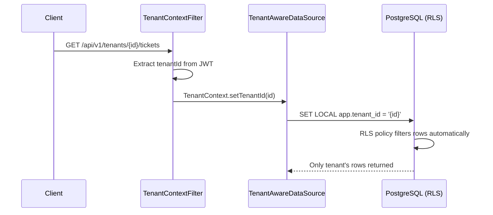
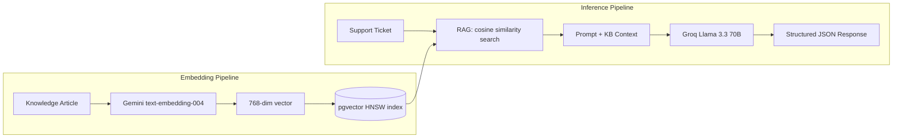
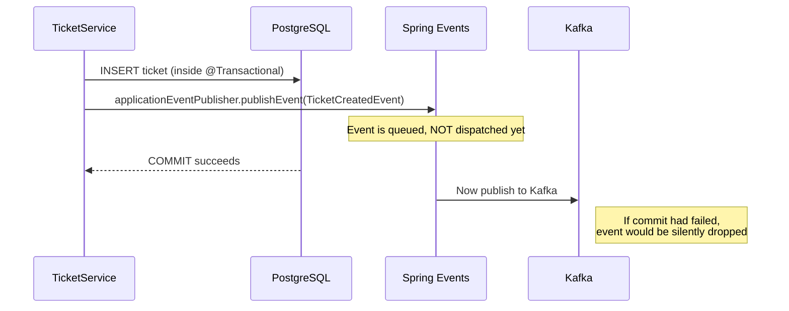

# Architecture Decision Records (ADRs)

A narrative walkthrough of the key engineering tradeoffs behind Nexus.
Each section explains **what** we chose, **why** we chose it, and **what we traded away**.

---

## 1. Row-Level Security vs. Schema-per-Tenant

**Decision:** Enforce tenant isolation at the database row level using PostgreSQL RLS policies, not by creating a separate schema (or database) per tenant.

**Why RLS?**

| Consideration | RLS (our choice) | Schema-per-Tenant |
|---|---|---|
| **Connection pool** | Single shared pool → simpler, lower memory | One pool per tenant → N × connection overhead |
| **Migrations** | Run Flyway once, applies to all tenants | Must apply each migration to every schema |
| **Query complexity** | Standard SQL — RLS is invisible to app code | Every query must specify `SET search_path` |
| **Operational cost** | Single set of indexes, vacuum configs | Linear in tenant count |
| **Scaling ceiling** | Practical up to ~10K tenants (beyond that, shard) | ~100–500 tenants before migration pain |

**How it works:**



The [`TenantAwareDataSource`](../nexus-app/src/main/java/com/nexus/common/multitenancy/TenantAwareDataSource.java) intercepts `setAutoCommit(false)` — the moment Spring starts a transaction — and injects `SET LOCAL app.tenant_id = '...'`. Because `SET LOCAL` is scoped to the transaction, the context is automatically cleared on commit/rollback. No connection pool pollution, no manual cleanup.

**What we traded away:**
- RLS is PostgreSQL-specific — migrating to MySQL or DynamoDB would require rearchitecting isolation.
- Performance depends on proper indexing (`tenant_id` must be in every WHERE clause path).
- A buggy RLS policy is invisible — data leaks silently. We mitigate this with [`CrossTenantIsolationIT`](../nexus-app/src/test/java/com/nexus/tenant/CrossTenantIsolationIT.java), a Testcontainers integration test that proves tenant A cannot see tenant B's data.

---

## 2. Dual-Vendor AI: Groq + Gemini

**Decision:** Use **Groq** (Llama 3.3 70B) for chat inference and **Google Gemini** for embedding generation, rather than a single vendor for both.

**Why split vendors?**

| Concern | Groq (Inference) | Gemini (Embeddings) |
|---|---|---|
| **Speed** | Fastest available inference (~50 tokens/sec on 70B) | N/A for embeddings — one-shot vector output |
| **Cost** | Free tier for development, pay-per-token in prod | Free tier: 1500 req/day for `text-embedding-004` |
| **Model size** | 70B parameters → high-quality classification/replies | 768-dim embeddings → compact, good retrieval |
| **Lock-in risk** | Spring AI `ChatClient` abstracts the protocol | Direct HTTP to Gemini embedding API |



**Spring AI as the abstraction layer:** The [`TriageAgent`](../nexus-app/src/main/java/com/nexus/ai/triage/TriageAgent.java) uses Spring AI's `ChatClient` — not Groq's API directly. To swap Groq for OpenAI, Anthropic, or a local Ollama instance, you change one YAML property (`spring.ai.openai.base-url`). Zero code changes.

**What we traded away:**
- Operational complexity of managing two API keys and two vendor SLAs.
- Gemini embeddings are not the same model family as Llama 3.3 — there's a slight semantic mismatch. In practice, this has no measurable impact on retrieval quality for our knowledge base scale.

---

## 3. Mathematical Confidence Scoring vs. LLM Self-Report

**Decision:** Derive the auto-resolve confidence score from **measurable, deterministic signals**, not by asking the LLM "how confident are you?"

**Why?** LLMs are provably miscalibrated self-assessors. A model asked "rate your confidence 0–1" will consistently overestimate on ambiguous inputs and underestimate on simple ones. This is a known failure mode (documented in guardrails literature §9.3).

**Our formula (from [`ConfidenceScoreCalculator`](../nexus-app/src/main/java/com/nexus/ai/triage/ConfidenceScoreCalculator.java)):**

```
confidence = (0.50 × RAG similarity) + (0.25 × parse success) + (0.25 × category agreement)
```

| Signal | Weight | What it measures | Why it's reliable |
|---|---|---|---|
| **RAG similarity** | 50% | Average cosine similarity of retrieved KB articles | Purely mathematical — distance in vector space |
| **Parse success** | 25% | Did the LLM output valid structured JSON? | Binary — either the schema validated or it didn't |
| **Category agreement** | 25% | Does the AI's category match the KB articles' categories? | Cross-validation between two independent sources |

**Auto-resolve gate:** If `confidence ≥ threshold` (configurable, default 0.85), the ticket is auto-resolved with the AI's suggested reply. Otherwise, it's escalated to a human agent with the AI's reasoning attached.

**What we traded away:**
- The formula is intentionally conservative — it caps at ~0.95 even for perfect inputs (because the RAG similarity score rarely hits 1.0). This means some tickets that *could* be auto-resolved get escalated. We prefer false negatives (escalate a solvable ticket) over false positives (auto-resolve with a wrong answer).

---

## 4. Transactional Event Publishing (AFTER_COMMIT)

**Decision:** Use Spring's `@TransactionalEventListener(phase = AFTER_COMMIT)` to publish domain events to Kafka, rather than publishing inside the transaction or using a full Outbox table.

**Why AFTER_COMMIT?**



The [`TicketEventKafkaPublisher`](../nexus-app/src/main/java/com/nexus/ticket/infrastructure/messaging/TicketEventKafkaPublisher.java) uses `AFTER_COMMIT` to guarantee that:
1. **No phantom events** — if the DB transaction rolls back, the Kafka event is never sent.
2. **No blocking** — Kafka publishing happens asynchronously after the HTTP response is returned.

**Why NOT a full Outbox pattern?**
The Outbox pattern (write events to an `outbox` table in the same transaction, then a poller sends them to Kafka) provides **exactly-once** delivery. We chose `AFTER_COMMIT` because:
- Our notification microservice is **idempotent** — processing the same event twice is safe.
- Outbox adds significant complexity (polling, cleanup, dead-letter handling) for a guarantee we don't need yet.
- `AFTER_COMMIT` provides **at-most-once** semantics, which is acceptable for notifications.

**What we traded away:**
- If the app crashes between DB commit and Kafka send, the event is lost. For our use case (email/notification triggers), this is an acceptable risk. The Javadoc explicitly documents this tradeoff.

---

## 5. Redis Lua Sliding Window Rate Limiter

**Decision:** Implement rate limiting with an **atomic Redis Lua script** executing a sliding window counter, rather than using Resilience4j's built-in rate limiter or a token bucket.

**Why Redis + Lua?**

| Approach | Distributed? | Atomic? | Connection overhead |
|---|---|---|---|
| **In-memory (Resilience4j)** | ❌ Per-instance only | ✅ | None |
| **Redis INCR/EXPIRE (no Lua)** | ✅ | ❌ Race condition between INCR and EXPIRE | 2 round-trips |
| **Redis Lua (our choice)** | ✅ | ✅ Single round-trip | 1 round-trip |
| **Token bucket (Redis)** | ✅ | ✅ | 1 round-trip |

The Lua script in [`SlidingWindowRateLimiter`](../nexus-app/src/main/java/com/nexus/common/ratelimit/SlidingWindowRateLimiter.java) executes atomically on the Redis server:

```lua
local key = KEYS[1]
local limit = tonumber(ARGV[1])
local window = tonumber(ARGV[2])
local current = tonumber(redis.call('GET', key) or '0')
if current >= limit then
    local ttl = redis.call('PTTL', key)
    return {current, ttl}
end
current = redis.call('INCR', key)
if current == 1 then
    redis.call('EXPIRE', key, window)
end
local ttl = redis.call('PTTL', key)
return {current, ttl}
```

**Key design choices:**
- **Tenant-scoped keys** (`rate_limit:tenant:{tenantId}`) — each tenant has independent limits.
- **Fail-open** — if Redis is unavailable, requests are allowed (prefer availability over rate limit enforcement).
- **Self-cleaning** — keys expire automatically after the window duration. No cleanup cron needed.
- **Micrometer integration** — denied requests increment a `rate_limit.denied.count` counter, visible in Grafana.

**What we traded away:**
- Sliding window counters are slightly less accurate than sorted-set-based sliding logs (they quantize to the window start). For our use case (100 req/min), the ~1% error margin at window boundaries is acceptable.
- Redis becomes a dependency — if Redis is down, rate limiting is effectively disabled (fail-open). We accept this because our Redis instance is also used for caching, so if Redis is down, the entire system is already degraded.
