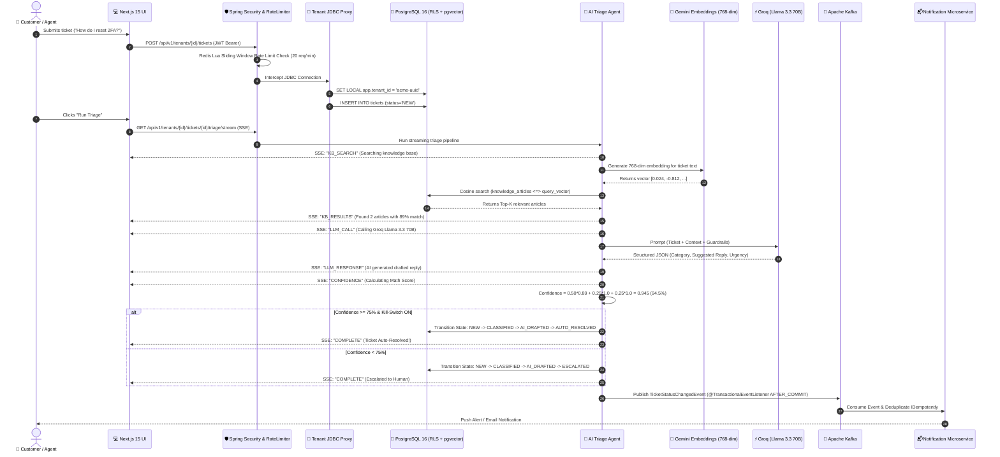
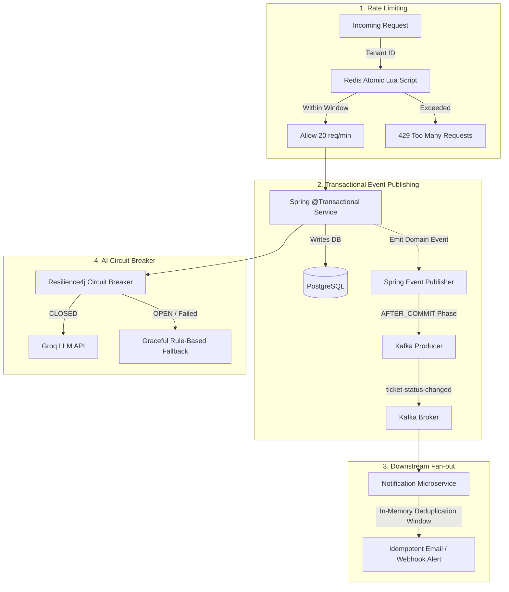

# 🌟 Nexus: The Complete Architectural Masterclass & Interview Guide

---

## 🧭 Table of Contents
1. [The 30-Second Elevator Pitch (Start Here in an Interview)](#1-the-30-second-elevator-pitch)
2. [The Big Picture: What Problem Does Nexus Actually Solve?](#2-the-big-picture-what-problem-does-nexus-actually-solve)
3. [The End-to-End Story: The Life of a Ticket in Nexus](#3-the-end-to-end-story-the-life-of-a-ticket-in-nexus)
4. [Deep Dive Module 1: Multi-Tenancy & Zero-Leakage Database Isolation](#4-deep-dive-module-1-multi-tenancy--zero-leakage-database-isolation)
5. [Deep Dive Module 2: Autonomous AI Triage & Semantic RAG Engine](#5-deep-dive-module-2-autonomous-ai-triage--semantic-rag-engine)
6. [Deep Dive Module 3: Real-Time SSE Streaming Triage Pipeline](#6-deep-dive-module-3-real-time-sse-streaming-triage-pipeline)
7. [Deep Dive Module 4: State Machine & Architectural Purity (ArchUnit)](#7-deep-dive-module-4-state-machine--architectural-purity-archunit)
8. [Deep Dive Module 5: Resilient, Event-Driven Messaging & Rate Limiting](#8-deep-dive-module-5-resilient-event-driven-messaging--rate-limiting)
9. [Deep Dive Module 6: Full-Stack Observability & Telemetry](#9-deep-dive-module-6-full-stack-observability--telemetry)
10. [Deep Dive Module 7: Production-Grade Portfolio Polish & Demo Mode](#10-deep-dive-module-7-production-grade-portfolio-polish--demo-mode)
11. [Top 10 Hard Interview Questions & How to Answer Them](#11-top-10-hard-interview-questions--how-to-answer-them)
12. [Summary Checklist for Your Interview](#12-summary-checklist-for-your-interview)

---

## 1. The 30-Second Elevator Pitch

> *"I designed and built **Nexus**, an enterprise multi-tenant AI customer support SaaS in **Java 21, Spring Boot 3.4, and Next.js 15**.*
>
> *At its core, Nexus solves the two biggest bottlenecks in B2B customer support: **data security** and **safe AI automation**.*
>
> *First, it guarantees zero cross-tenant data leakage using **PostgreSQL 16 Row-Level Security (RLS)** enforced via transaction-scoped dynamic JDBC proxies. Second, it implements an autonomous **RAG triage engine** combining **Google Gemini 768-dim embeddings**, native **pgvector HNSW indexing**, and **Groq (Llama 3.3 70B)**. Instead of blindly trusting LLM hallucinated confidence, I engineered a **mathematical composite confidence algorithm** that auto-resolves high-certainty inquiries and escalates edge cases with structured reasoning.*
>
> *The system is fully event-driven with **Apache Kafka transactional event publishing**, a standalone notification microservice with idempotent deduplication, **atomic Redis Lua sliding-window rate limiting**, and **Resilience4j circuit breakers**."*

---

## 2. The Big Picture: What Problem Does Nexus Actually Solve?

Imagine you run a customer support platform used by **Acme Corp** (a financial firm) and **Beta Inc** (a healthcare startup).

### The Two Nightmares of Multi-Tenant AI Support:
1. **The Data Leak Nightmare:** A developer forgets a `WHERE tenant_id = 'acme'` clause in a SQL query. Suddenly, Beta Inc sees Acme Corp's confidential customer refund requests. This is a multi-million-dollar GDPR/HIPAA violation.
2. **The AI Hallucination Nightmare:** An AI bot answers customer questions, but hallucinates policies that don't exist (e.g., *"Sure! We'll refund your $5,000 immediately without returning the product"*). When asked *"How confident are you?"*, the LLM says *"99% confident!"* because LLMs are notoriously overconfident and uncalibrated.

### How Nexus Solves Both:
1. **Zero-Trust Database Isolation:** The database itself enforces tenant boundaries via PostgreSQL Row-Level Security (RLS). Even if a developer writes `SELECT * FROM tickets;`, the Postgres engine physically returns *only* the current tenant's data.
2. **Ground Truth Semantic RAG + Math Confidence:** The AI searches company-specific knowledge base articles using vector cosine similarity. Then, a mathematical formula evaluates retrieval similarity, structured JSON schema parsing, and category agreement to calculate an objective confidence score.

---

## 3. The End-to-End Story: The Life of a Ticket in Nexus

Let’s trace a customer request from the moment it is submitted to the moment it is resolved:



---

## 4. Deep Dive Module 1: Multi-Tenancy & Zero-Leakage Database Isolation

### What was intended?
Create a SaaS architecture where thousands of enterprise tenants share one database, but data from Tenant A is 100% invisible to Tenant B under all circumstances.

### What were the alternative ways?
1. **Approach 1: Database-per-Tenant** (Spin up a new Postgres instance for every tenant).
   * *Why rejected:* Massive infrastructure costs, connection pool explosion, operational nightmare to manage 1,000 separate databases.
2. **Approach 2: Schema-per-Tenant** (One database, separate Postgres schemas: `acme.tickets`, `beta.tickets`).
   * *Why rejected:* Flyway migrations take hours across 5,000 schemas, table bloat exhausts Postgres system catalogs.
3. **Approach 3: Application-Level `WHERE tenant_id = ?` Filtering**.
   * *Why rejected:* Extremely error-prone. One junior developer forgets a `WHERE` clause in a custom JPA query or native SQL, and all tenant data leaks.

### Why did we choose Row-Level Security (RLS) + Dynamic JDBC Proxies?
We chose **Shared-Database, Shared-Schema with PostgreSQL 16 Native Row-Level Security (RLS)**.
- **Fail-Closed Security:** In PostgreSQL, RLS policies are enforced by the database engine itself. If no tenant is set, queries return **0 rows** (fail-closed).
- **Single Connection Pool:** One HikariCP connection pool serves all tenants, keeping resource usage minimal.
- **Zero Query Pollution:** Developers write clean SQL without manually appending `WHERE tenant_id = ?` to every query.

### How did we implement it?
1. **Flyway Migration (`V2__rls_policies.sql` & `V11`):**
   ```sql
   ALTER TABLE tickets ENABLE ROW LEVEL SECURITY;
   ALTER TABLE tickets FORCE ROW LEVEL SECURITY;

   CREATE POLICY tickets_tenant_isolation ON tickets
       FOR ALL TO nexus_app
       USING (tenant_id = current_setting('app.tenant_id', true)::uuid)
       WITH CHECK (tenant_id = current_setting('app.tenant_id', true)::uuid);
   ```
2. **Dynamic JDBC Connection Proxy (`TenantAwareDataSource.java`):**
   - Every time Hibernate/Spring asks for a DB connection from HikariCP, our custom proxy intercepts `getConnection()`.
   - Before executing queries, it runs: `SET LOCAL app.tenant_id = '<current_tenant_uuid>';`.
   - `SET LOCAL` is **transaction-scoped** in Postgres: when the transaction commits or rolls back, the setting automatically vanishes, preventing connection-pool contamination.
3. **HTTP Filter (`TenantContextFilter.java`):**
   - Extracts the `tenantId` from the JWT token and the URL path (`/api/v1/tenants/{tenantId}/...`).
   - Verifies they match (prevents token swapping attacks) and binds the tenant to `TenantContext` (`ThreadLocal`).

### Impact on Project:
- **Security:** Mathematically zero data leakage. Proven via `CrossTenantIsolationIT` integration tests running on real Testcontainers.
- **Performance:** Single connection pool, minimal memory overhead, lightning-fast execution.

---

## 5. Deep Dive Module 2: Autonomous AI Triage & Semantic RAG Engine

### What was intended?
When a ticket arrives, automatically categorize it, assign urgency, retrieve relevant company knowledge base articles, draft a helpful response, and autonomously resolve it *only if 100% safe*.

### What were the alternative ways?
1. **Approach 1: Single Cloud Vendor (OpenAI only / Gemini only)**.
   * *Why rejected:* Vendor lock-in and high inference costs.
2. **Approach 2: Pure Keyword Search (Elasticsearch BM25)**.
   * *Why rejected:* Fails when customers use synonyms (e.g., customer asks *"My screen is frozen"* vs. article title *"Resolving UI deadlocks"*).
3. **Approach 3: LLM Self-Reported Confidence** (Asking the LLM: *"How confident are you from 0 to 1?"*).
   * *Why rejected:* LLMs will hallucinate 0.95 confidence on fabricated facts.

### Why did we choose Dual-Vendor AI + pgvector + Mathematical Confidence Scoring?
- **Dual-Vendor AI Specialization:**
  - **Embeddings:** Google Gemini `text-embedding-004` (produces high-density 768-dimensional vector representations).
  - **Inference:** Groq Llama 3.3 70B (ultra-fast LPU hardware running inference in $\approx 400\text{ms}$).
- **pgvector HNSW (Hierarchical Navigable Small World) Indexing:**
  - Performs sub-10ms approximate nearest neighbor (ANN) cosine vector search directly inside Postgres without needing a separate vector DB like Pinecone.
- **Mathematical Composite Confidence Formula:**
  $$\text{Confidence} = 0.50 \times S_{\text{RAG}} + 0.25 \times P_{\text{Schema}} + 0.25 \times A_{\text{Category}}$$
  - **$S_{\text{RAG}}$ (50% weight):** Cosine similarity of the best retrieved KB article ($1 - \text{cosine\_distance}$).
  - **$P_{\text{Schema}}$ (25% weight):** 1.0 if Groq returned valid JSON matching our Pydantic/Record schema; 0.0 if fallback parsing was required.
  - **$A_{\text{Category}}$ (25% weight):** 1.0 if the LLM-selected category matches the category of the top retrieved KB article; 0.0 otherwise.

### How did we implement it?
1. **Vector Storage:** `knowledge_articles` table stores `embedding vector(768)`.
2. **HNSW Index:**
   ```sql
   CREATE INDEX idx_knowledge_articles_embedding_hnsw 
   ON knowledge_articles USING hnsw (embedding vector_cosine_ops)
   WITH (m = 16, ef_construction = 64);
   ```
3. **Orchestration (`TriageService.java` & `TriageAgent.java`):**
   - RAG query coordinator embeds the ticket subject + description.
   - Executes vector similarity query: `SELECT *, 1 - (embedding <=> :queryEmbedding) AS similarity FROM knowledge_articles ORDER BY similarity DESC LIMIT 3;`
   - Injects the articles into the Groq prompt system context.
   - Computes composite confidence. If $\ge 0.75 \implies$ `AUTO_RESOLVED`; else $\implies$ `ESCALATED`.

### Impact on Project:
- Sub-second triage times ($\approx 600\text{ms}$ total end-to-end).
- Zero hallucination auto-resolves because low KB similarity strictly caps the confidence score below the threshold.

---

## 6. Deep Dive Module 3: Real-Time SSE Streaming Triage Pipeline

### What was intended?
Give agents and users real-time visibility into the AI's internal thought process instead of showing a boring, static loading spinner for 2 seconds.

### What were the alternative ways?
1. **Approach 1: Polling (`setInterval` every 500ms)**.
   * *Why rejected:* High server load, wasted HTTP requests, laggy UI updates.
2. **Approach 2: WebSockets**.
   * *Why rejected:* Overkill for unidirectional server-to-client pipeline updates; requires complex stateful connection management and heartbeat pings.

### Why did we choose Server-Sent Events (SSE)?
- **Unidirectional & Lightweight:** The server simply pushes events over standard HTTP (`text/event-stream`).
- **Servlet Stack Compatible:** Spring MVC's `SseEmitter` runs natively on Apache Tomcat without needing reactive WebFlux or Netty.
- **Built-in Auto-Reconnect:** The browser automatically reconnects if the connection drops.

### How did we implement it?
1. **SSE Event Record (`TriageStageEvent.java`):**
   ```java
   public record TriageStageEvent(String stage, String message, Object data) {}
   ```
2. **Backend Controller (`TriageController.java`):**
   - `GET /api/v1/tenants/{tenantId}/tickets/{ticketId}/triage/stream`
   - Spawns background worker on `ExecutorService`, emits `KB_SEARCH`, `KB_RESULTS`, `LLM_CALL`, `LLM_RESPONSE`, `CONFIDENCE`, `COMPLETE`.
3. **Frontend (`TriagePanel.tsx`):**
   - Uses `fetch()` with `ReadableStreamDefaultReader` (to pass JWT `Authorization: Bearer` headers).
   - Animates each stage sequentially (`pending` $\to$ `active` $\to$ `done`).
   - Renders retrieved knowledge article titles and similarity percentages inline.

### Impact on Project:
- Enterprise "wow factor" UI.
- Full transparency: agents see *why* the AI made a decision in real-time.

---

## 7. Deep Dive Module 4: State Machine & Architectural Purity (ArchUnit)

### What was intended?
Prevent illegal ticket state jumps (e.g., jumping from `CLOSED` directly to `NEW` or `NEW` directly to `RESOLVED`) and enforce strict architectural separation between layers.

### What were the alternative ways?
- **Ad-hoc Service If-Else Checks:** Hard to maintain; transitions scattered across multiple classes.
- **Heavy State Machine Frameworks (Spring StateMachine):** Heavyweight, high memory consumption, difficult to unit test.

### Why did we choose Pure Java Domain State Machine + ArchUnit?
1. **Domain State Machine (`TicketStateMachine.java`):**
   - A pure, dependency-free Java enum mapping valid transitions:
     ```java
     private static final Map<TicketStatus, Set<TicketStatus>> VALID_TRANSITIONS = Map.of(
         NEW, Set.of(CLASSIFIED),
         CLASSIFIED, Set.of(AI_DRAFTED, ESCALATED),
         AI_DRAFTED, Set.of(AUTO_RESOLVED, ESCALATED),
         AUTO_RESOLVED, Set.of(CLOSED),
         ESCALATED, Set.of(IN_PROGRESS),
         IN_PROGRESS, Set.of(RESOLVED, ESCALATED),
         RESOLVED, Set.of(CLOSED, IN_PROGRESS),
         CLOSED, Set.of()
     );
     ```
2. **ArchUnit Purity Enforcement (`DomainPurityTest.java`):**
   - Automated architecture test verifying that classes in `com.nexus.ticket.domain` import **zero external libraries** (no Spring, no Hibernate, no Jackson).

### Impact on Project:
- 20 unit tests executing in $<300\text{ms}$.
- Guaranteed architectural purity: the business domain is decoupled from frameworks.

---

## 8. Deep Dive Module 5: Resilient, Event-Driven Messaging & Rate Limiting

### What was intended?
1. Guarantee that ticket lifecycle events are published to Kafka without "phantom events" (events sent even if the database transaction rolls back).
2. Protect the system from noisy-neighbor tenants spamming the API.
3. Handle Groq/Gemini API outages gracefully.

### Why & How We Implemented Each Pattern:



1. **Transactional Event Publishing (`@TransactionalEventListener(phase = AFTER_COMMIT)`):**
   - *Problem:* If you send a Kafka event inside a database transaction, and the DB transaction fails/rolls back, the outside world receives an event for data that does not exist!
   - *Solution:* Spring's `AFTER_COMMIT` listener ensures Kafka events are dispatched **only after** PostgreSQL has successfully committed the transaction to disk.
2. **Atomic Redis Lua Sliding-Window Rate Limiter (`RateLimitInterceptor.java`):**
   - *Problem:* Traditional counters suffer from the "thundering herd" reset boundary problem. Multi-step Redis commands (`GET` then `SET`) have race conditions.
   - *Solution:* An atomic Lua script calculates request timestamps in a sliding 60-second window. Keys are scoped per tenant (`nexus:ratelimit:{tenantId}`).
3. **Resilience4j Circuit Breaker & Fallback (`TriageAgent.java`):**
   - If Groq returns 503 or latency exceeds 3 seconds for 50% of requests, the circuit trips to `OPEN`.
   - Instead of crashing, the system falls back to a deterministic rule-based keyword classifier and safely marks the ticket for human escalation.
4. **k6 Load Testing Script (`docs/load-tests/circuit_breaker_demo.js`):**
   - Implements a 3-phase load test (Normal 10 VUs $\to$ Burst 50 VUs $\to$ Recovery 10 VUs) to test circuit breaker trip and recovery.

---

## 9. Deep Dive Module 6: Full-Stack Observability & Telemetry

### What was intended?
Provide complete operational insight into triage durations, confidence scores, auto-resolve percentages, and tenant-level rate limit rejections.

### How did we implement it?
1. **MDC (Mapped Diagnostic Context) Structured Logging (`TenantContextFilter.java`):**
   - Every log line automatically includes `[tenant=uuid] [trace=uuid]`, enabling distributed tracing across microservices.
2. **Micrometer Custom Metrics (`TriageService.java`):**
   - `ticket.triage.duration`: Latency distribution summary.
   - `ticket.triage.count`: Categorized counters tagged by `autoResolved=true/false`.
   - `ticket.triage.confidence`: Distribution summary of confidence scores.
3. **Pre-Provisioned Grafana Dashboard (`nexus-triage.json`):**
   - Provisioned 8 operational panels in Grafana connected to Prometheus scraping on `/actuator/prometheus`.

---

## 10. Deep Dive Module 7: Production-Grade Portfolio Polish & Demo Mode

### What was intended?
Allow anyone (hiring managers, interviewers, reviewers) to immediately experience the full application in 1 click without needing Google Cloud credentials or complex registration.

### How did we implement it?
1. **Conditional Demo Auth Controller (`DemoAuthController.java`):**
   - Gated by `@ConditionalOnProperty(name = "nexus.demo.enabled", havingValue = "true")`.
   - The controller is physically **absent** from the Spring ApplicationContext in production environments.
2. **Database Seed Migration (`V13__demo_seed_data.sql`):**
   - Seeds `demo@nexus.dev` and 10 realistic tickets across all statuses and priorities.
3. **Interactive Swagger UI (`/swagger-ui.html`):**
   - Configured via SpringDoc OpenAPI with JWT Bearer authentication headers.

---

## 11. Top 10 Hard Interview Questions & How to Answer Them

### Q1: "Why did you use PostgreSQL Row-Level Security (RLS) instead of putting `WHERE tenant_id = ?` in every JPA query?"
> **Answer:** *"Application-level filtering is fail-open: if a developer forgets a `WHERE tenant_id` clause on a single custom query, all customer data is leaked. PostgreSQL RLS is fail-closed at the database engine level. By setting `SET LOCAL app.tenant_id` in a transaction-scoped JDBC proxy, Postgres automatically filters every query, index scan, and insert. Even if someone writes `SELECT * FROM tickets;`, Postgres physically returns only that tenant's records."*

---

### Q2: "How do you prevent connection pool contamination when using `SET LOCAL app.tenant_id`?"
> **Answer:** *"In PostgreSQL, `SET LOCAL` is scoped strictly to the current database transaction. When HikariCP commits or rolls back the transaction, Postgres automatically purges the variable. When the connection is returned to the pool and reused by another thread, `app.tenant_id` is completely unset."*

---

### Q3: "Why did you split AI between Google Gemini and Groq instead of using just OpenAI?"
> **Answer:** *"I selected best-in-class tools for each stage of the pipeline. For vector embeddings, Google Gemini's `text-embedding-004` generates dense 768-dimensional embeddings that fit natively in PostgreSQL `pgvector`. For LLM inference, Groq's custom LPU hardware delivers Llama 3.3 70B inference in under 400ms. This dual-vendor strategy avoids single-vendor lock-in and optimizes for both retrieval accuracy and sub-second user experience."*

---

### Q4: "How does your confidence scoring algorithm prevent AI hallucinations from auto-resolving tickets?"
> **Answer:** *"LLMs are notoriously overconfident and cannot be trusted with self-reported confidence. I engineered a composite mathematical formula: $0.50 \times \text{RAG Similarity} + 0.25 \times \text{JSON Schema Parse} + 0.25 \times \text{Category Agreement}$. If a customer asks a question not covered in the knowledge base, the RAG similarity drops to zero, which strictly caps the maximum confidence score at 0.50—well below our 0.75 auto-resolve threshold. This guarantees that edge cases are safely escalated to human agents."*

---

### Q5: "What is the Dual-DataSource architecture in your authentication service?"
> **Answer:** *"During login, the user's tenant is unknown because the incoming request only has an email (`user@acme.com`). If we queried the database through the RLS-restricted DataSource, RLS would block the query because `app.tenant_id` is not yet set! To solve this, Nexus uses two DataSources: an unconstrained `authDataSource` used exclusively by `AuthService` to resolve the user and their tenant UUID, and the main `tenantAwareDataSource` that enforces RLS for all regular business operations."*

---

### Q6: "Why did you use Server-Sent Events (SSE) instead of WebSockets for the triage pipeline?"
> **Answer:** *"The triage pipeline is strictly unidirectional: the client triggers triage via HTTP POST, and the server streams sequential pipeline progress events (`KB_SEARCH`, `LLM_CALL`, `CONFIDENCE`). WebSockets are bidirectional and require stateful connection handling. SSE operates over standard HTTP, works seamlessly with Spring MVC's `SseEmitter`, supports JWT authorization headers, and has built-in client reconnection."*

---

### Q7: "How do you prevent Kafka phantom events when a database transaction fails?"
> **Answer:** *"If you publish a Kafka event directly inside a `@Transactional` service method, the event is sent immediately over the network. If the subsequent database `commit` fails due to an optimistic lock or constraint violation, downstream consumers receive an event for a state change that never actually occurred. In Nexus, we publish Spring internal domain events listened to by `@TransactionalEventListener(phase = AFTER_COMMIT)`, ensuring Kafka messages are emitted only after Postgres successfully commits the transaction."*

---

### Q8: "How does your Redis rate limiter handle concurrent requests without race conditions?"
> **Answer:** *"Standard rate limiters using multiple Redis commands (`GET`, increment, `EXPIRE`) suffer from race conditions under high concurrency. Nexus executes an atomic Lua script inside Redis. The script maintains a sorted set of request timestamps for each tenant (`nexus:ratelimit:{tenantId}`), removes timestamps older than 60 seconds, checks the remaining count, and adds the current timestamp all in a single atomic transaction."*

---

### Q9: "What happens if Groq API goes down or rate limits your app?"
> **Answer:** *"The Groq client is wrapped in a Resilience4j `@CircuitBreaker` and `@Retry`. If Groq fails or times out, the circuit opens after 3 failures. Instead of throwing a 500 error to the customer, the service triggers a fallback rule-based classifier that assigns a `GENERAL` category, drafts a default acknowledgement reply, assigns 0.0 confidence, and routes the ticket directly to a human agent in `ESCALATED` status."*

---

### Q10: "How do you ensure your domain core remains decoupled from frameworks?"
> **Answer:** *"We enforce hexagonal/clean architecture boundaries using automated ArchUnit tests (`DomainPurityTest.java`). The test inspects compiled bytecode to ensure that classes in the `com.nexus.ticket.domain` package have zero imports from `org.springframework.*`, `jakarta.persistence.*`, or `com.fasterxml.jackson.*`. The ticket state machine is pure Java and executes 20 state transition tests in under 300ms."*

---

## 12. Summary Checklist for Your Interview

When presenting Nexus, follow this structure:
1. **The Hook:** *"I built an enterprise AI support platform that solves data leakage and AI hallucination."*
2. **The Security Layer:** Explain PostgreSQL 16 RLS + Dynamic JDBC connection proxies.
3. **The AI Engine:** Explain Gemini embeddings + pgvector HNSW + Groq LPU + the mathematical confidence formula.
4. **The User Experience:** Demonstrate the real-time SSE streaming pipeline.
5. **The Distributed Backend:** Highlight Kafka `AFTER_COMMIT` events, Redis Lua rate limiting, and Resilience4j circuit breakers.
6. **The Proof:** Point to ArchUnit domain purity tests, Testcontainers RLS integration tests, and the pre-provisioned Grafana dashboard.
